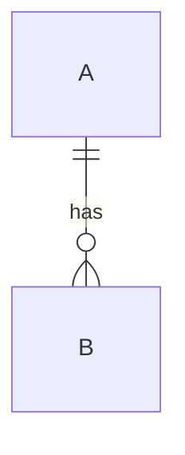

# 설계 산출물 스킬 구현 계획

> **For agentic workers:** REQUIRED SUB-SKILL: Use superpowers:subagent-driven-development (recommended) or superpowers:executing-plans to implement this plan task-by-task. Steps use checkbox (`- [ ]`) syntax for tracking.

**Goal:** SRS·SDS·아키텍처·API·ERD·테이블 6종을 Markdown 원문에서 `.docx`로 만드는 사용자 호출 스킬 6개와,
템플릿·산출 md를 검사하는 기계 검증기를 추가함.

**Architecture:** stdlib 전용 md 리더(`_design_md.py`) 위에 검사기(`design_doc_check.py`)와
변환기(`design_doc_render.py`, markdown-it-py + python-docx)를 둠. 템플릿은 `templates/design-docs/`에서
`/flow-init`이 호스트로 시딩하고, 이후 호스트 사본이 유일한 기준. 스킬 6개는 검사 → (작성) → 검사 → 변환을 조율함.

**Tech Stack:** Python 3.8+ (호스트 복사본), PyYAML, markdown-it-py, python-docx, Kroki HTTP API, pytest.

**Spec:** `docs/superpowers/specs/2026-09-21-design-doc-skills-design.md`

## Global Constraints

- 호스트에 복사되는 스크립트는 Python 3.8 호환: `from __future__ import annotations`, `typing.List/Dict/Tuple/Optional`, `str.removeprefix` 금지, `match` 금지.
- 복사 스크립트의 import는 sibling 우선, 실패 시 `scripts.` 패키지 폴백 (`srs_check.py` 머리와 동일 패턴).
- Invariant 2: CLI 진입점마다 `force_utf8_io()`, 파일 I/O는 `encoding="utf-8"`.
- 텍스트는 읽자마자 `\r\n` → `\n` 정규화. 추적 파일의 raw 바이트 digest 금지.
- 저장소 안 모든 코드 주석·docstring·rules·SKILL.md·테스트 메시지는 영어. 한국어는 `templates/design-docs/*.template.md`(소비자 편집용 양식 데이터)와 그 문자열을 비교하는 테스트에만.
- 주석은 `rules/doc-style.md` — 이유·제약만, 한 줄.
- 커밋은 태스크마다 하지 않음: DEV 게이트가 `review.done`·`doc-sync.done`을 요구함. 전체 완료 후 리뷰·doc-sync를 거쳐 `Skill: commit`으로 커밋 1개(`feat`).
- 테스트 파일 500줄 초과 금지, 폴더 `tests/design_docs/`에 `__init__.py`.
- 규칙 코드 문자열(`T-FRONT` 등)은 스펙 표 그대로.

## 파일 구조

| 파일 | 책임 |
|---|---|
| `scripts/_design_md.py` | 생성: md 한 파일을 front matter·헤딩·표·펜스·앵커·링크·ID 토큰·placeholder·repeat 마커로 읽음 (stdlib + PyYAML) |
| `scripts/design_doc_check.py` | 생성: 설정 해석, `--templates`·`--doc`·`--paths` CLI, 규칙 T-*/S-* |
| `scripts/design_doc_render.py` | 생성: md → docx, Kroki 도식, 표지·개정 이력·목차, `--check-deps` |
| `scripts/_harness_paths.py` | 수정: `DESIGN_TEMPLATES_DIR` 상수 |
| `scripts/flow_init_setup.py` | 수정: `COPY_FILES` 3개 추가, `seed_design_templates`, gitignore 선택 반영 |
| `templates/design-docs/*.template.md` | 생성: 6종 템플릿 (한국어 양식) |
| `skills/design-{srs,sds,architecture,api,erd,table}/SKILL.md` | 생성 |
| `rules/design-docs.md` | 생성: 산출 md 작성 규약 (ID·링크·인벤토리·재실행) |
| `skills/flow-init/SKILL.md`, `skills/flow-init/references/setup-script-actions.md` | 수정: `design_docs` 슬롯, 시딩 |
| `flow-config.example.yaml` | 수정: `design_docs` 블록 |
| `pyproject.toml`, `uv.lock` | 수정: dev 의존성 `python-docx`, `markdown-it-py` |
| `README.md`, `README.ko.md`, `USAGE.md`, `USAGE.ko.md`, `docs/usage/design-docs.md`, `docs/usage/design-docs.ko.md`, `CLAUDE.md` | 수정/생성: 등재 |
| `tests/design_docs/` | 생성: 테스트 |

---

### Task 1: md 리더 `_design_md.py`

**Files:**
- Create: `scripts/_design_md.py`
- Test: `tests/design_docs/__init__.py`, `tests/design_docs/_helpers.py`, `tests/design_docs/test_md_reader.py`

**Interfaces:**
- Produces:
  - `parse(text: str) -> Doc`
  - `split_front(text: str) -> Tuple[Optional[dict], Optional[str], str, int]` — (front, error, body, 본문 시작 전 줄 수)
  - `Doc` 필드: `front`, `front_error`, `headings: List[Heading]`, `tables: List[Table]`, `fences: List[Fence]`, `anchors: List[Tuple[str,int]]`(소문자 id, 줄), `links: List[Tuple[str,str,int]]`(경로, fragment, 줄), `tokens: List[Tuple[str,int]]`(대문자 ID), `placeholders: List[Tuple[str,int]]`, `repeats: List[Tuple[str,int]]`(접두어, 줄), `last_line: int`
  - `Doc.section_end(idx: int) -> int` — `headings[idx]` 다음, 레벨 ≤ 그 레벨인 헤딩의 줄 번호(없으면 `last_line + 1`)
  - `Doc.tokens_between(start: int, end: int) -> List[str]`, `Doc.tables_between(start, end) -> List[Table]`, `Doc.fences_between(start, end) -> List[Fence]`
  - `Heading(level, text, raw, line)`, `Table(path: Tuple[str,...], header: List[str], rows: List[List[str]], line)`, `Fence(lang, body, line)`
  - `ID_TOKEN_RE`, `ANCHOR_RE` (모듈 상수)
- 줄 번호는 파일 기준 1-base (front matter 포함).

- [ ] **Step 1: 테스트 헬퍼·실패 테스트 작성**

`tests/design_docs/__init__.py`: 빈 파일.

`tests/design_docs/_helpers.py`:

```python
from pathlib import Path

REPO = Path(__file__).resolve().parent.parent.parent


def write(root: Path, rel: str, text: str) -> Path:
    p = root / rel
    p.parent.mkdir(parents=True, exist_ok=True)
    p.write_text(text, encoding="utf-8")
    return p
```

`tests/design_docs/test_md_reader.py`:

```python
"""The reader every design-doc rule stands on: a miscounted line or a table read under
the wrong heading turns into a violation pointing at the wrong place."""

from scripts._design_md import parse, split_front

DOC = """---
title: T
---
# Top

## 1. 개요
<a id="tbl-001"></a>**TBL-001** refers to [FR-PAY-001](../srs/pay.md#fr-pay-001) and ENT-002.

<!-- repeat: TBL -->
### {{TBL-ID}} name

| 컬럼명 | 타입 |
|---|---|
| id | int |
| `x|y` | a \\| b |



<!-- a comment
spanning FR-NOPE-001 lines -->
## 2. 끝 ##
"""


def test_front_matter_and_line_numbers():
    front, err, body, offset = split_front(DOC)
    assert front == {"title": "T"} and err is None and offset == 3
    doc = parse(DOC)
    assert [(h.level, h.text, h.line) for h in doc.headings] == [
        (1, "Top", 4),
        (2, "1. 개요", 6),
        (3, "{{TBL-ID}} name", 10),
        (2, "2. 끝", 24),
    ]


def test_table_path_header_rows():
    doc = parse(DOC)
    (table,) = doc.tables
    assert table.path == ("Top", "1. 개요", "{{TBL-ID}} name")
    assert table.header == ["컬럼명", "타입"]
    assert table.rows == [["id", "int"], ["`x|y`", "a \\| b"]]
    assert table.line == 12


def test_anchor_link_token_placeholder_repeat():
    doc = parse(DOC)
    assert doc.anchors == [("tbl-001", 7)]
    assert doc.links == [("../srs/pay.md", "fr-pay-001", 7)]
    assert ("FR-PAY-001", 7) in doc.tokens and ("ENT-002", 7) in doc.tokens
    assert ("TBL-001", 7) in doc.tokens
    assert doc.placeholders == [("{{TBL-ID}}", 10)]
    assert doc.repeats == [("TBL", 9)]


def test_comments_hide_tokens_and_fences_are_kept_apart():
    doc = parse(DOC)
    assert all(tok != "FR-NOPE-001" for tok, _ in doc.tokens)
    (fence,) = doc.fences
    assert fence.lang == "mermaid" and fence.line == 17
    assert fence.body.startswith("erDiagram")


def test_crlf_is_read_like_lf():
    assert parse(DOC.replace("\n", "\r\n")).headings == parse(DOC).headings


def test_section_end_and_between():
    doc = parse(DOC)
    assert doc.section_end(1) == 24
    assert doc.section_end(3) == doc.last_line + 1
    assert [t.line for t in doc.tables_between(6, 24)] == [12]
    assert "TBL-001" in doc.tokens_between(6, 24)


def test_broken_front_matter_is_reported_not_raised():
    doc = parse("---\n: [\n---\n# X\n")
    assert doc.front is None and doc.front_error
```

- [ ] **Step 2: 실패 확인**

Run: `uv run pytest tests/design_docs/test_md_reader.py -v`
Expected: FAIL — `ModuleNotFoundError: No module named 'scripts._design_md'`

- [ ] **Step 3: 구현**

`scripts/_design_md.py`:

```python
"""Line-level Markdown reading for the design-doc checker and renderer.

Stdlib and PyYAML only: the checker runs before the renderer's dependencies are
installed, so a template error reaches the user before any install question.
"""

from __future__ import annotations

import re
from dataclasses import dataclass, field
from typing import List, Optional, Tuple

import yaml

_FRONT_RE = re.compile(r"\A---[ \t]*\n(.*?)\n---[ \t]*(?:\n|\Z)", re.DOTALL)
_FENCE_OPEN_RE = re.compile(r"^[ \t]{0,3}(`{3,}|~{3,})[ \t]*([\w+-]*)")
_HEADING_RE = re.compile(r"^[ \t]{0,3}(#{1,6})[ \t]+(.+)$")
_CLOSING_HASHES_RE = re.compile(r"[ \t]+#+$")
_REPEAT_RE = re.compile(r"^[ \t]*<!--[ \t]*repeat:[ \t]*([A-Z][A-Z0-9]*)[ \t]*-->[ \t]*$")
_COMMENT_RE = re.compile(r"<!--.*?-->", re.DOTALL)
ANCHOR_RE = re.compile(r'<a\s[^>]*\bid\s*=\s*["\']([^"\']+)["\']', re.IGNORECASE)
# Same shape as srs_check._LINK_RE: images excluded, optional title allowed.
_LINK_RE = re.compile(r"(?<!!)\[[^\]]*\]\(\s*([^)\s#]*)(?:#([^)\s]*))?(?:\s+[\"'][^\")]*[\"'])?\s*\)")
_LINK_URL_RE = re.compile(r"\]\([^)]*\)")
_TAG_RE = re.compile(r"</?[A-Za-z][^>]*>")
_INLINE_CODE_RE = re.compile(r"`[^`]*`")
_CELL_SPLIT_RE = re.compile(r"(?<!\\)\|")
_SEP_CELL_RE = re.compile(r"^:?-+:?$")
ID_TOKEN_RE = re.compile(r"(?<![\w-])([A-Z][A-Z0-9]*(?:-[A-Z][A-Z0-9]*)*-\d{3})(?![\w-])")
PLACEHOLDER_RE = re.compile(r"\{\{[^}]*\}\}")
_REPEAT_SENTINEL = "\x00repeat:"


@dataclass
class Heading:
    level: int
    text: str
    raw: str
    line: int


@dataclass
class Table:
    path: Tuple[str, ...]
    header: List[str]
    rows: List[List[str]]
    line: int


@dataclass
class Fence:
    lang: str
    body: str
    line: int


@dataclass
class Doc:
    front: Optional[dict]
    front_error: Optional[str]
    headings: List[Heading] = field(default_factory=list)
    tables: List[Table] = field(default_factory=list)
    fences: List[Fence] = field(default_factory=list)
    anchors: List[Tuple[str, int]] = field(default_factory=list)
    links: List[Tuple[str, str, int]] = field(default_factory=list)
    tokens: List[Tuple[str, int]] = field(default_factory=list)
    placeholders: List[Tuple[str, int]] = field(default_factory=list)
    repeats: List[Tuple[str, int]] = field(default_factory=list)
    last_line: int = 0

    def section_end(self, idx: int) -> int:
        level = self.headings[idx].level
        for h in self.headings[idx + 1 :]:
            if h.level <= level:
                return h.line
        return self.last_line + 1

    def tokens_between(self, start: int, end: int) -> List[str]:
        return [t for t, n in self.tokens if start <= n < end]

    def tables_between(self, start: int, end: int) -> List[Table]:
        return [t for t in self.tables if start <= t.line < end]

    def fences_between(self, start: int, end: int) -> List[Fence]:
        return [f for f in self.fences if start <= f.line < end]


def split_front(text: str) -> Tuple[Optional[dict], Optional[str], str, int]:
    text = text.replace("\r\n", "\n")
    m = _FRONT_RE.match(text)
    if not m:
        return None, None, text, 0
    offset = text[: m.end()].count("\n")
    if not text[: m.end()].endswith("\n"):
        offset += 1
    try:
        loaded = yaml.safe_load(m.group(1))
    except yaml.YAMLError as exc:
        return None, f"front matter YAML error: {str(exc).splitlines()[0]}", text[m.end() :], offset
    if not isinstance(loaded, dict):
        return None, "front matter is not a mapping", text[m.end() :], offset
    return loaded, None, text[m.end() :], offset


def plain(text: str) -> str:
    return _TAG_RE.sub("", text).replace("**", "").strip()


def split_cells(line: str) -> List[str]:
    s = line.strip()
    if s.startswith("|"):
        s = s[1:]
    if s.endswith("|") and not s.endswith("\\|"):
        s = s[:-1]
    # A pipe inside inline code is content, not a cell border.
    cells: List[str] = []
    buf = ""
    in_code = False
    for ch_idx, ch in enumerate(s):
        if ch == "`":
            in_code = not in_code
        if ch == "|" and not in_code and (ch_idx == 0 or s[ch_idx - 1] != "\\"):
            cells.append(buf.strip())
            buf = ""
            continue
        buf += ch
    cells.append(buf.strip())
    return cells


def _is_separator(line: str) -> bool:
    if "|" not in line:
        return False
    cells = split_cells(line)
    return bool(cells) and all(_SEP_CELL_RE.match(c) for c in cells)


def _strip_comments(body: str) -> str:
    """Blank every comment but keep its newlines, so line numbers survive; the repeat
    marker is a comment the checker needs, so it is swapped for a sentinel first."""
    body = re.sub(
        r"<!--[ \t]*repeat:[ \t]*([A-Z][A-Z0-9]*)[ \t]*-->",
        lambda m: _REPEAT_SENTINEL + m.group(1),
        body,
    )
    return _COMMENT_RE.sub(lambda m: "\n" * m.group(0).count("\n"), body)


def _scan_inline(doc: Doc, s: str, no: int) -> None:
    for m in ANCHOR_RE.finditer(s):
        doc.anchors.append((m.group(1).lower(), no))
    code_free = _INLINE_CODE_RE.sub("", s)
    for m in _LINK_RE.finditer(code_free):
        doc.links.append((m.group(1), m.group(2) or "", no))
    prose = _LINK_URL_RE.sub("]", _TAG_RE.sub("", code_free))
    for m in ID_TOKEN_RE.finditer(prose):
        doc.tokens.append((m.group(1), no))
    for p in PLACEHOLDER_RE.findall(s):
        doc.placeholders.append((p, no))


def parse(text: str) -> Doc:
    front, err, body, offset = split_front(text)
    doc = Doc(front=front, front_error=err)
    lines = _strip_comments(body).split("\n")
    doc.last_line = offset + len(lines)
    path: List[Tuple[int, str]] = []
    fence: Optional[Tuple[str, str, int, List[str]]] = None
    i = 0
    while i < len(lines):
        ln = lines[i]
        no = offset + i + 1
        if fence is not None:
            stripped = ln.strip()
            marker = fence[0]
            if stripped.startswith(marker) and set(stripped) == {marker[0]}:
                doc.fences.append(Fence(fence[1], "\n".join(fence[3]), fence[2]))
                fence = None
            else:
                fence[3].append(ln)
                for p in PLACEHOLDER_RE.findall(ln):
                    doc.placeholders.append((p, no))
            i += 1
            continue
        fm = _FENCE_OPEN_RE.match(ln)
        if fm:
            fence = (fm.group(1), fm.group(2).lower(), no, [])
            i += 1
            continue
        if ln.strip().startswith(_REPEAT_SENTINEL):
            doc.repeats.append((ln.strip()[len(_REPEAT_SENTINEL) :], no))
            i += 1
            continue
        hm = _HEADING_RE.match(ln)
        if hm:
            level = len(hm.group(1))
            raw = _CLOSING_HASHES_RE.sub("", hm.group(2)).strip()
            doc.headings.append(Heading(level, plain(raw), raw, no))
            while path and path[-1][0] >= level:
                path.pop()
            path.append((level, plain(raw)))
            _scan_inline(doc, raw, no)
            i += 1
            continue
        if ln.lstrip().startswith("|") and i + 1 < len(lines) and _is_separator(lines[i + 1]):
            header = [plain(c) for c in split_cells(ln)]
            _scan_inline(doc, ln, no)
            rows: List[List[str]] = []
            j = i + 2
            while j < len(lines) and lines[j].lstrip().startswith("|"):
                rows.append(split_cells(lines[j]))
                _scan_inline(doc, lines[j], offset + j + 1)
                j += 1
            doc.tables.append(Table(tuple(t for _, t in path), header, rows, no))
            i = j
            continue
        _scan_inline(doc, ln, no)
        i += 1
    if fence is not None:
        doc.fences.append(Fence(fence[1], "\n".join(fence[3]), fence[2]))
    return doc
```

- [ ] **Step 4: 통과 확인**

Run: `uv run pytest tests/design_docs/test_md_reader.py -v`
Expected: PASS (7 tests). 실패하면 테스트의 기대 줄 번호를 먼저 손으로 세어 확인하고, 구현을 고침(테스트 기대값을 구현에 맞춰 바꾸지 않음).

---

### Task 2: 설정·템플릿 검사 (`--templates`)

**Files:**
- Modify: `scripts/_harness_paths.py` (상수 추가, `CONFIG_FILENAME` 근처)
- Create: `scripts/design_doc_check.py`
- Test: `tests/design_docs/test_templates_check.py`

**Interfaces:**
- Consumes: Task 1 `parse`, `Doc`.
- Produces:
  - `_harness_paths.DESIGN_TEMPLATES_DIR = f"{HARNESS_DIR}/templates/design-docs"`
  - `design_doc_check.DEFAULTS: dict` — `templates`, `docs`, `output`, `renderer`, `base_docx`, `gitignore_output`
  - `DOCS = ("srs","sds","architecture","api","erd","table")`, `CONVERT_ONLY = ("srs","sds")`, `SRS_KINDS = ("C","FR","NFR","CON","TERM","ROLE")`
  - `load_settings(root: Path) -> dict`
  - `Violation(file, where, code, message)` + `.format() -> str`
  - `load_templates(tdir: Path) -> Dict[str, Doc]`
  - `prefixes(t: Doc) -> List[str]`
  - `source_files(root: Path, globs: list) -> List[Path]`
  - `check_templates(tdir: Path, root: Path) -> List[Violation]`

- [ ] **Step 1: 실패 테스트 작성**

`tests/design_docs/test_templates_check.py`:

```python
"""`--templates` runs first in every skill: a consumer-edited template that breaks here
must name the file, the place and the fix, and every break must come out in one pass."""

from pathlib import Path

from scripts.design_doc_check import DOCS, check_templates, load_settings
from tests.design_docs._helpers import write

TDIR = ".claude/harness-tier/templates/design-docs"

GOOD = {
    "srs": "---\ndoc: srs\ntitle: SRS\nstandard: 29148\nsources: [docs/srs/*.md]\n---\n",
    "sds": "---\ndoc: sds\ntitle: SDS\nstandard: 1016\nsources: [docs/sds/*.md]\n---\n",
    "architecture": "---\ndoc: architecture\ntitle: A\nstandard: s\nid_prefix: [CMP, IF]\n"
    "refs: [FR, NFR]\n---\n## 1. 개요\n",
    "api": "---\ndoc: api\ntitle: B\nstandard: s\nid_prefix: [API]\nrefs: [FR, CMP]\n"
    "inventory: 부록 A\n---\n## 1. 개요\n## 부록 A\n",
    "erd": "---\ndoc: erd\ntitle: E\nstandard: s\nid_prefix: [ENT]\nrefs: [FR]\n---\n## 1. 개요\n",
    "table": "---\ndoc: table\ntitle: T\nstandard: s\nid_prefix: [TBL]\nrefs: [FR, ENT]\n---\n"
    "## 1. 개요\n## 2. 상세\n<!-- repeat: TBL -->\n### {{TBL-ID}}\n\n| 컬럼명 | 타입 |\n|---|---|\n",
}


def seed(root: Path, **override: str) -> Path:
    write(root, "docs/srs/README.md", "# SRS\n")
    write(root, "docs/sds/README.md", "# SDS\n")
    for name in DOCS:
        text = override.get(name, GOOD[name])
        if text is not None:
            write(root, f"{TDIR}/{name}.template.md", text)
    return root / TDIR


def codes(vs):
    return sorted(v.code for v in vs)


def test_shipped_shape_is_clean(tmp_path):
    assert check_templates(seed(tmp_path), tmp_path) == []


def test_missing_directory_and_file(tmp_path):
    assert codes(check_templates(tmp_path / TDIR, tmp_path)) == ["T-MISSING"]
    tdir = seed(tmp_path)
    (tdir / "sds.template.md").unlink()
    vs = check_templates(tdir, tmp_path)
    assert codes(vs) == ["T-MISSING"] and vs[0].file == "sds.template.md"


def test_front_rules(tmp_path):
    tdir = seed(
        tmp_path,
        erd="---\ndoc: erdx\ntitle: E\nid_prefix: [ENT]\ncolour: red\n---\n",
    )
    msgs = [v.message for v in check_templates(tdir, tmp_path) if v.code == "T-FRONT"]
    assert any("standard" in m for m in msgs)
    assert any("colour" in m for m in msgs)
    assert any("erdx" in m for m in msgs)


def test_prefix_and_refs(tmp_path):
    tdir = seed(
        tmp_path,
        erd="---\ndoc: erd\ntitle: E\nstandard: s\nid_prefix: [TBL, fr]\nrefs: [XYZ]\n---\n",
    )
    vs = check_templates(tdir, tmp_path)
    assert codes(vs).count("T-PREFIX") == 2  # TBL duplicated, 'fr' malformed
    assert "T-REFS" in codes(vs)


def test_heading_table_repeat(tmp_path):
    tdir = seed(
        tmp_path,
        erd="---\ndoc: erd\ntitle: E\nstandard: s\nid_prefix: [ENT]\n---\n"
        "## 1. 개요\n## 1. 개요\n\n| a | a |\n|---|---|\n<!-- repeat: TBL -->\n",
    )
    got = codes(check_templates(tdir, tmp_path))
    assert got == ["T-HEADING", "T-REPEAT", "T-REPEAT", "T-TABLE"]


def test_sources_must_match_files(tmp_path):
    tdir = seed(tmp_path, sds="---\ndoc: sds\ntitle: S\nstandard: s\nsources: [docs/none/*.md]\n---\n")
    assert codes(check_templates(tdir, tmp_path)) == ["T-SOURCES"]


def test_inventory_must_name_a_heading(tmp_path):
    tdir = seed(tmp_path, api=GOOD["api"].replace("## 부록 A\n", ""))
    assert codes(check_templates(tdir, tmp_path)) == ["T-FRONT"]


def test_settings_defaults_and_override(tmp_path):
    assert load_settings(tmp_path)["docs"] == "docs/deliverables"
    write(
        tmp_path,
        ".claude/harness-tier/config/flow-config.yaml",
        "design_docs:\n  docs: out/md\n  renderer: http://kroki.local\n",
    )
    s = load_settings(tmp_path)
    assert s["docs"] == "out/md" and s["renderer"] == "http://kroki.local"
    assert s["output"] == "docs/deliverables/results"
```

- [ ] **Step 2: 실패 확인**

Run: `uv run pytest tests/design_docs/test_templates_check.py -v`
Expected: FAIL — `ModuleNotFoundError: No module named 'scripts.design_doc_check'`

- [ ] **Step 3: `_harness_paths.py` 상수 추가**

`CONFIG_FILENAME` 정의 블록 바로 아래에 추가:

```python
DESIGN_TEMPLATES_DIR = f"{HARNESS_DIR}/templates/design-docs"  # host-owned, seeded once
```

- [ ] **Step 4: `design_doc_check.py` 뼈대 + 템플릿 검사 구현**

```python
"""Checks behind the /design-* skills: the templates a consumer may edit, and the
Markdown each skill writes or converts.

Every rule reports and none stops the scan, so one run lists everything to fix. Not a
gate: a skill runs it at start and after writing.
"""

from __future__ import annotations

import argparse
import re
import sys
from dataclasses import dataclass
from pathlib import Path
from typing import Dict, List, Optional, Set, Tuple

import yaml

try:
    from _harness_paths import DESIGN_TEMPLATES_DIR, config_path, force_utf8_io, host_root
except ImportError:
    from scripts._harness_paths import DESIGN_TEMPLATES_DIR, config_path, force_utf8_io, host_root

try:
    from _design_md import ID_TOKEN_RE, Doc, parse
except ImportError:
    from scripts._design_md import ID_TOKEN_RE, Doc, parse

DEFAULTS = {
    "templates": DESIGN_TEMPLATES_DIR,
    "docs": "docs/deliverables",
    "output": "docs/deliverables/results",
    "renderer": "https://kroki.io",
    "base_docx": None,
    "gitignore_output": False,
}
DOCS = ("srs", "sds", "architecture", "api", "erd", "table")
CONVERT_ONLY = ("srs", "sds")
SRS_KINDS = ("C", "FR", "NFR", "CON", "TERM", "ROLE")
FRONT_KEYS = ("doc", "title", "standard", "id_prefix", "refs", "sources", "inventory", "labels", "revisions")
REQUIRED_FRONT = ("doc", "title", "standard")
_PREFIX_RE = re.compile(r"^[A-Z][A-Z0-9]{1,5}$")


@dataclass(frozen=True)
class Violation:
    file: str
    where: str
    code: str
    message: str

    def format(self) -> str:
        return f"{self.file}  {self.where}  {self.code}  {self.message}"


def load_settings(root: Path) -> dict:
    settings = dict(DEFAULTS)
    try:
        cfg = yaml.safe_load(config_path(root).read_text(encoding="utf-8")) or {}
    except (OSError, yaml.YAMLError):
        cfg = {}
    block = cfg.get("design_docs") if isinstance(cfg, dict) else None
    if isinstance(block, dict):
        for key in DEFAULTS:
            if block.get(key) is not None:
                settings[key] = block[key]
    return settings


def _read(path: Path) -> str:
    return path.read_text(encoding="utf-8").replace("\r\n", "\n")


def template_file(tdir: Path, name: str) -> Path:
    return tdir / f"{name}.template.md"


def load_templates(tdir: Path) -> Dict[str, Doc]:
    out: Dict[str, Doc] = {}
    for name in DOCS:
        path = template_file(tdir, name)
        if path.is_file():
            out[name] = parse(_read(path))
    return out


def prefixes(t: Doc) -> List[str]:
    value = (t.front or {}).get("id_prefix") or []
    if isinstance(value, str):
        return [value]
    return [v for v in value if isinstance(v, str)] if isinstance(value, list) else []


def source_files(root: Path, globs: list) -> List[Path]:
    seen: List[Path] = []
    for pattern in globs:
        if not isinstance(pattern, str):
            continue
        for match in sorted(root.glob(pattern)):
            if match.is_file() and match not in seen:
                seen.append(match)
    return seen


def repeat_headings(t: Doc) -> List[Tuple[str, int]]:
    """(prefix, index into t.headings) for every repeat marker that has a heading after it."""
    out: List[Tuple[str, int]] = []
    for prefix, line in t.repeats:
        for idx, h in enumerate(t.headings):
            if h.line > line:
                out.append((prefix, idx))
                break
    return out


def check_templates(tdir: Path, root: Path) -> List[Violation]:
    if not tdir.is_dir():
        return [Violation(str(tdir), "-", "T-MISSING", "template directory not found — run /flow-init to seed it")]
    vs: List[Violation] = []
    templates = load_templates(tdir)
    for name in DOCS:
        if name not in templates:
            vs.append(Violation(f"{name}.template.md", "-", "T-MISSING",
                                "template not found — copy it back from the plugin's templates/design-docs/"))
    owner: Dict[str, str] = {}
    for name, t in templates.items():
        f = f"{name}.template.md"
        if t.front is None:
            vs.append(Violation(f, "front matter", "T-FRONT", t.front_error or "front matter missing"))
            continue
        for key in REQUIRED_FRONT:
            if not t.front.get(key):
                vs.append(Violation(f, "front matter", "T-FRONT", f"required key '{key}' missing"))
        for key in t.front:
            if key not in FRONT_KEYS:
                vs.append(Violation(f, "front matter", "T-FRONT",
                                    f"unknown key '{key}' — allowed: {', '.join(FRONT_KEYS)}"))
        if t.front.get("doc") and t.front["doc"] != name:
            vs.append(Violation(f, "front matter", "T-FRONT",
                                f"doc '{t.front['doc']}' does not match the file name '{name}'"))
        if name in CONVERT_ONLY:
            src = t.front.get("sources")
            if not isinstance(src, list) or not src:
                vs.append(Violation(f, "sources", "T-SOURCES", "sources must be a non-empty list of repo-relative globs"))
            elif not source_files(root, src):
                vs.append(Violation(f, "sources", "T-SOURCES", f"no file matches {src}"))
            continue
        raw = t.front.get("id_prefix")
        items = raw if isinstance(raw, list) else [raw]
        for p in items:
            if not isinstance(p, str) or not _PREFIX_RE.match(p):
                vs.append(Violation(f, "id_prefix", "T-PREFIX",
                                    f"'{p}' is not an upper-case prefix of 2-6 characters"))
            elif p in SRS_KINDS:
                vs.append(Violation(f, "id_prefix", "T-PREFIX", f"'{p}' is an SRS id kind"))
            elif p in owner:
                vs.append(Violation(f, "id_prefix", "T-PREFIX", f"'{p}' is also issued by {owner[p]}.template.md"))
            else:
                owner[p] = name
    known = set(SRS_KINDS) | set(owner)
    for name, t in templates.items():
        if t.front is None or name in CONVERT_ONLY:
            continue
        vs += _template_body(f"{name}.template.md", t, known)
    return vs


def _template_body(f: str, t: Doc, known: Set[str]) -> List[Violation]:
    vs: List[Violation] = []
    front = t.front or {}
    refs = front.get("refs", [])
    if not isinstance(refs, list):
        vs.append(Violation(f, "refs", "T-REFS", "refs must be a list of id kinds"))
    else:
        for r in refs:
            if r not in known:
                vs.append(Violation(f, "refs", "T-REFS",
                                    f"'{r}' is issued by neither the SRS nor any template — known: {', '.join(sorted(known))}"))
    own = prefixes(t)
    repeat_idx = {idx for _, idx in repeat_headings(t)}
    for prefix, line in t.repeats:
        if not any(h.line > line for h in t.headings):
            vs.append(Violation(f, f"line {line}", "T-REPEAT", "repeat marker has no heading after it"))
        if prefix not in own:
            vs.append(Violation(f, f"line {line}", "T-REPEAT", f"repeat prefix '{prefix}' is not in id_prefix {own}"))
    seen: Set[str] = set()
    for idx, h in enumerate(t.headings):
        if not h.text:
            vs.append(Violation(f, f"line {h.line}", "T-HEADING", "empty heading"))
        elif idx not in repeat_idx:
            if h.text in seen:
                vs.append(Violation(f, f"line {h.line}", "T-HEADING", f"duplicate heading '{h.text}'"))
            seen.add(h.text)
    for table in t.tables:
        if any(not c for c in table.header):
            vs.append(Violation(f, f"line {table.line}", "T-TABLE", "table header has an empty column"))
        dup = sorted({c for c in table.header if c and table.header.count(c) > 1})
        if dup:
            vs.append(Violation(f, f"line {table.line}", "T-TABLE", f"duplicate columns {dup}"))
    inventory = front.get("inventory")
    if inventory and inventory not in seen:
        vs.append(Violation(f, "inventory", "T-FRONT", f"inventory names heading '{inventory}', which the template lacks"))
    return vs
```

- [ ] **Step 5: 통과 확인**

Run: `uv run pytest tests/design_docs/test_templates_check.py -v`
Expected: PASS (8 tests). `test_heading_table_repeat`의 `T-REPEAT` 2건 = "뒤에 헤딩 없음" + "접두어 TBL이 id_prefix에 없음".

---

### Task 3: 산출 md 구조 검사 (S-FRONT · S-HEADING · S-TABLE · S-PLACEHOLDER · S-ID)

**Files:**
- Modify: `scripts/design_doc_check.py`
- Test: `tests/design_docs/_fixture.py`, `tests/design_docs/test_doc_structure.py`

**Interfaces:**
- Consumes: Task 2 전부.
- Produces:
  - `check_structure(root: Path, rel: str, doc: Doc, t: Doc, templates: Dict[str, Doc]) -> List[Violation]` — 위 5개 규칙
  - `known_kinds(templates) -> Dict[str, str]` — 종류 → 발급 문서(`"srs"` 포함)
  - `wiki_nodes(root: Path, wroot: str) -> Set[str]`
- `tests/design_docs/_fixture.py`의 `make_host(tmp_path) -> Path`: SRS·템플릿·산출 md가 모두 깨끗한 호스트. 이후 태스크가 한 군데씩 깨서 씀.

- [ ] **Step 1: 공용 fixture 작성**

`tests/design_docs/_fixture.py`:

```python
"""A host where every design doc passes, so each test breaks exactly one thing."""

from pathlib import Path

from tests.design_docs._helpers import write

TDIR = ".claude/harness-tier/templates/design-docs"

SRS_README = """---
wiki_id: srs.readme
title: SRS
tags: [srs]
---
# SRS
<a id="c-001"></a>**C-001** pay
<a id="nfr-perf-001"></a>**NFR-PERF-001** fast
"""

SRS_PAY = """---
wiki_id: srs.pay
title: Pay
tags: [srs]
---
# Pay
<a id="fr-pay-001"></a>**FR-PAY-001** charge (← [C-001](README.md#c-001))
"""

SDS = """---
wiki_id: sds.readme
title: SDS
tags: [sds]
sources: {}
---
# SDS
#### billing
- Implemented requirements: [FR-PAY-001](../srs/pay.md#fr-pay-001)


"""

TEMPLATES = {
    "srs": "---\ndoc: srs\ntitle: 요구사항 명세서\nstandard: ISO/IEC/IEEE 29148\n"
    "sources: [docs/srs/README.md, docs/srs/*.md]\n---\n",
    "sds": "---\ndoc: sds\ntitle: 설계 명세서\nstandard: IEEE 1016\nsources: [docs/sds/*.md]\n---\n",
    "architecture": """---
doc: architecture
title: 아키텍처 설계서
standard: ISO/IEC/IEEE 42010
id_prefix: [CMP, IF]
refs: [C, FR, NFR]
---
## 1. 개요
## 2. 컴포넌트
<!-- repeat: CMP -->
### {{CMP-ID}} {{이름}}

| 항목 | 내용 |
|---|---|

## 3. 추적표

| 요구사항 | 컴포넌트 |
|---|---|
""",
    "api": """---
doc: api
title: API 명세서
standard: OpenAPI
id_prefix: [API]
refs: [FR, CMP, TBL]
inventory: 부록 A. 코드 인벤토리
---
## 1. 개요
## 2. API 상세
<!-- repeat: API -->
### {{API-ID}} {{메서드 경로}}

| 항목 | 내용 |
|---|---|

## 부록 A. 코드 인벤토리

| 대상 | 근거 | 문서 ID |
|---|---|---|
""",
    "erd": """---
doc: erd
title: ERD
standard: SI
id_prefix: [ENT]
refs: [FR]
inventory: 부록 A. 코드 인벤토리
---
## 1. 개요
## 2. 엔터티

| 엔터티ID | 이름 |
|---|---|

## 부록 A. 코드 인벤토리

| 대상 | 근거 | 문서 ID |
|---|---|---|
""",
    "table": """---
doc: table
title: 테이블 명세서
standard: SI
id_prefix: [TBL]
refs: [FR, ENT]
inventory: 부록 A. 코드 인벤토리
---
## 1. 개요
## 2. 테이블 상세
<!-- repeat: TBL -->
### {{TBL-ID}} {{물리명}}

| 컬럼명 | 타입 | FK |
|---|---|---|

## 부록 A. 코드 인벤토리

| 대상 | 근거 | 문서 ID |
|---|---|---|
""",
}


def _front(name: str, title: str, related: str = "[srs.readme]") -> str:
    return (
        f"---\nwiki_id: deliverables.{name}\ntitle: {title}\ntags: [deliverable, {name}]\n"
        f"related: {related}\nsources: {{}}\n"
        "revisions:\n  - {version: '1.0', date: 2026-09-21, summary: first}\n---\n"
    )


DOCS_MD = {
    "architecture": _front("architecture", "아키텍처 설계서")
    + """## 1. 개요
## 2. 컴포넌트
### <a id="cmp-001"></a>CMP-001 billing

| 항목 | 내용 |
|---|---|
| 책임 | [FR-PAY-001](../srs/pay.md#fr-pay-001), [NFR-PERF-001](../srs/README.md#nfr-perf-001) |

## 3. 추적표

| 요구사항 | 컴포넌트 |
|---|---|
| FR-PAY-001 | [CMP-001](#cmp-001) |
""",
    "api": _front("api", "API 명세서")
    + """## 1. 개요
## 2. API 상세
### <a id="api-001"></a>API-001 POST /pay

| 항목 | 내용 |
|---|---|
| 컴포넌트 | [CMP-001](architecture.md#cmp-001) |
| 요구사항 | FR-PAY-001 |

## 부록 A. 코드 인벤토리

```bash
grep -rn "@app.post" src
```

| 대상 | 근거 | 문서 ID |
|---|---|---|
| POST /pay | src/app.py | API-001 |
""",
    "erd": _front("erd", "ERD")
    + """## 1. 개요
## 2. 엔터티

| 엔터티ID | 이름 |
|---|---|
| <a id="ent-001"></a>ENT-001 | payment (FR-PAY-001) |

## 부록 A. 코드 인벤토리

```bash
grep -rn "class .*Model" src
```

| 대상 | 근거 | 문서 ID |
|---|---|---|
| Payment | src/models.py | ENT-001 |
""",
    "table": _front("table", "테이블 명세서")
    + """## 1. 개요
## 2. 테이블 상세
### <a id="tbl-001"></a>TBL-001 payment (ENT-001)

| 컬럼명 | 타입 | FK |
|---|---|---|
| id | int | - |

## 부록 A. 코드 인벤토리

```bash
grep -rn "CREATE TABLE" migrations
```

| 대상 | 근거 | 문서 ID |
|---|---|---|
| payment | src/models.py | TBL-001 |
""",
}


def make_host(root: Path) -> Path:
    write(root, "docs/srs/README.md", SRS_README)
    write(root, "docs/srs/pay.md", SRS_PAY)
    write(root, "docs/sds/README.md", SDS)
    write(root, "src/app.py", "app = 1\n")
    write(root, "src/models.py", "class Payment: ...\n")
    for name, text in TEMPLATES.items():
        write(root, f"{TDIR}/{name}.template.md", text)
    for name, text in DOCS_MD.items():
        write(root, f"docs/deliverables/{name}.md", text)
    return root
```

- [ ] **Step 2: 실패 테스트 작성**

`tests/design_docs/test_doc_structure.py`:

```python
"""Structure rules compare the written Markdown to the consumer's template, so an edited
template moves what they demand; each case edits one side and expects one code."""

from pathlib import Path

from scripts._design_md import parse
from scripts.design_doc_check import check_structure, load_templates
from tests.design_docs._fixture import DOCS_MD, TDIR, TEMPLATES, make_host
from tests.design_docs._helpers import write


def run(root: Path, name: str):
    templates = load_templates(root / TDIR)
    rel = f"docs/deliverables/{name}.md"
    doc = parse((root / rel).read_text(encoding="utf-8"))
    return check_structure(root, rel, doc, templates[name], templates)


def codes(vs):
    return sorted(v.code for v in vs)


def test_fixture_is_clean(tmp_path):
    make_host(tmp_path)
    for name in DOCS_MD:
        assert run(tmp_path, name) == [], name


def test_front_matter_rules(tmp_path):
    make_host(tmp_path)
    text = DOCS_MD["erd"].replace("wiki_id: deliverables.erd", "wiki_id: erd").replace(
        "related: [srs.readme]", "related: [srs.nowhere]"
    )
    write(tmp_path, "docs/deliverables/erd.md", text)
    msgs = [v.message for v in run(tmp_path, "erd")]
    assert codes(run(tmp_path, "erd")) == ["S-FRONT", "S-FRONT"]
    assert any("deliverables.erd" in m for m in msgs) and any("srs.nowhere" in m for m in msgs)


def test_missing_front_matter(tmp_path):
    make_host(tmp_path)
    body = DOCS_MD["erd"].split("---\n", 2)[2]
    write(tmp_path, "docs/deliverables/erd.md", body)
    assert "S-FRONT" in codes(run(tmp_path, "erd"))


def test_heading_missing_and_out_of_order(tmp_path):
    make_host(tmp_path)
    text = DOCS_MD["erd"].replace("## 1. 개요\n", "")
    write(tmp_path, "docs/deliverables/erd.md", text)
    assert codes(run(tmp_path, "erd")) == ["S-HEADING"]
    text = DOCS_MD["erd"].replace("## 1. 개요\n## 2. 엔터티\n", "## 2. 엔터티\n## 1. 개요\n")
    write(tmp_path, "docs/deliverables/erd.md", text)
    assert "S-HEADING" in codes(run(tmp_path, "erd"))


def test_template_edit_moves_the_demand(tmp_path):
    make_host(tmp_path)
    write(tmp_path, f"{TDIR}/erd.template.md", TEMPLATES["erd"].replace("| 엔터티ID | 이름 |\n|---|---|",
                                                                        "| 엔터티ID | 이름 | 설명 |\n|---|---|---|"))
    vs = run(tmp_path, "erd")
    assert codes(vs) == ["S-TABLE"] and "설명" in vs[0].message


def test_repeat_block_table_and_id(tmp_path):
    make_host(tmp_path)
    text = DOCS_MD["table"].replace("| 컬럼명 | 타입 | FK |", "| 컬럼명 | 형식 | FK |")
    write(tmp_path, "docs/deliverables/table.md", text)
    assert codes(run(tmp_path, "table")) == ["S-TABLE"]
    text = DOCS_MD["table"].replace('### <a id="tbl-001"></a>TBL-001 payment', "### payment")
    write(tmp_path, "docs/deliverables/table.md", text)
    assert "S-HEADING" in codes(run(tmp_path, "table"))


def test_placeholder_left(tmp_path):
    make_host(tmp_path)
    write(tmp_path, "docs/deliverables/erd.md", DOCS_MD["erd"].replace("payment (FR", "{{이름}} (FR"))
    assert codes(run(tmp_path, "erd")) == ["S-PLACEHOLDER"]


def test_id_rules(tmp_path):
    make_host(tmp_path)
    text = DOCS_MD["erd"].replace(
        "| 엔터티ID | 이름 |\n|---|---|\n",
        '| 엔터티ID | 이름 |\n|---|---|\n| <a id="ent-001"></a>ENT-001 | dup |\n'
        '| <a id="ent-1"></a>ENT-1 | short |\n| <a id="tbl-009"></a>TBL-009 | foreign |\n',
    )
    write(tmp_path, "docs/deliverables/erd.md", text)
    msgs = [v.message for v in run(tmp_path, "erd") if v.code == "S-ID"]
    assert len(msgs) == 3
    assert any("duplicate" in m for m in msgs)
    assert any("ent-1" in m for m in msgs)
    assert any("table" in m for m in msgs)
```

- [ ] **Step 3: 실패 확인**

Run: `uv run pytest tests/design_docs/test_doc_structure.py -v`
Expected: FAIL — `ImportError: cannot import name 'check_structure'`

- [ ] **Step 4: 구현 추가** (`design_doc_check.py`, `_template_body` 아래)

import 블록에 추가:

```python
try:
    from wiki_graph import _wiki_root_hint, derive_wiki_id
except ImportError:
    from scripts.wiki_graph import _wiki_root_hint, derive_wiki_id
```

코드:

```python
_FRONT_ONLY_RE = re.compile(r"\A---[ \t]*\n(.*?)\n---", re.DOTALL)


def known_kinds(templates: Dict[str, Doc]) -> Dict[str, str]:
    kinds = {k: "srs" for k in SRS_KINDS}
    for name, t in templates.items():
        for p in prefixes(t):
            kinds.setdefault(p, name)
    return kinds


def wiki_nodes(root: Path, wroot: str) -> Set[str]:
    nodes: Set[str] = set()
    base = root / wroot
    for path in base.rglob("*.md") if base.is_dir() else []:
        m = _FRONT_ONLY_RE.match(_read(path))
        if not m:
            continue
        try:
            front = yaml.safe_load(m.group(1))
        except yaml.YAMLError:
            continue
        if isinstance(front, dict) and isinstance(front.get("wiki_id"), str):
            nodes.add(front["wiki_id"])
    return nodes


def _check_front(root: Path, rel: str, doc: Doc) -> List[Violation]:
    if doc.front is None:
        return [Violation(rel, "front matter", "S-FRONT",
                          doc.front_error or "wiki front matter missing (wiki_id, title, tags, revisions)")]
    vs: List[Violation] = []
    wroot = _wiki_root_hint(root)
    try:
        expected: Optional[str] = derive_wiki_id(rel, wroot)
    except ValueError as exc:
        expected = None
        vs.append(Violation(rel, "wiki_id", "S-FRONT", f"no wiki_id derivable: {exc}"))
    if expected and doc.front.get("wiki_id") != expected:
        vs.append(Violation(rel, "wiki_id", "S-FRONT",
                            f"wiki_id must be '{expected}' (wiki_graph.py --derive-id {rel})"))
    if not doc.front.get("title"):
        vs.append(Violation(rel, "title", "S-FRONT", "title missing"))
    tags = doc.front.get("tags")
    if not isinstance(tags, list) or not tags:
        vs.append(Violation(rel, "tags", "S-FRONT", "tags must be a non-empty list"))
    related = doc.front.get("related") or []
    if related:
        nodes = wiki_nodes(root, wroot)
        for r in related if isinstance(related, list) else [related]:
            if r not in nodes:
                vs.append(Violation(rel, "related", "S-FRONT",
                                    f"related '{r}' is no wiki node — no document carries that wiki_id"))
    revs = doc.front.get("revisions")
    if not isinstance(revs, list) or not revs or not all(
        isinstance(r, dict) and r.get("version") and r.get("date") and r.get("summary") for r in revs
    ):
        vs.append(Violation(rel, "revisions", "S-FRONT", "revisions must list {version, date, summary} rows"))
    return vs


def _find_heading(doc: Doc, text: str, start: int = 0) -> int:
    for idx in range(start, len(doc.headings)):
        if doc.headings[idx].text == text:
            return idx
    return -1


def _block_ranges(t: Doc) -> List[Tuple[int, int]]:
    return [(t.headings[idx].line, t.section_end(idx)) for _, idx in repeat_headings(t)]


def _check_headings(rel: str, doc: Doc, t: Doc) -> List[Violation]:
    vs: List[Violation] = []
    repeat_idx = {idx for _, idx in repeat_headings(t)}
    blocks = _block_ranges(t)
    required = [
        h.text for idx, h in enumerate(t.headings)
        if idx not in repeat_idx and not any(s < h.line < e for s, e in blocks)
    ]
    pos = 0
    for text in required:
        found = _find_heading(doc, text, pos)
        if found >= 0:
            pos = found + 1
        elif _find_heading(doc, text) >= 0:
            vs.append(Violation(rel, text, "S-HEADING", f"heading '{text}' is out of the template's order"))
        else:
            vs.append(Violation(rel, text, "S-HEADING", f"heading '{text}' missing"))
    return vs


def _header_diff(expected: List[str], found: List[str]) -> str:
    missing = [c for c in expected if c not in found]
    extra = [c for c in found if c not in expected]
    return f"expected {' | '.join(expected)}; missing {missing}, extra {extra}"


def _check_tables(rel: str, doc: Doc, t: Doc) -> List[Violation]:
    vs: List[Violation] = []
    blocks = _block_ranges(t)
    for tt in t.tables:
        if any(s <= tt.line < e for s, e in blocks) or not tt.path:
            continue
        under = [d for d in doc.tables if d.path and d.path[-1] == tt.path[-1]]
        if not under:
            vs.append(Violation(rel, tt.path[-1], "S-TABLE", f"no table under '{tt.path[-1]}' — {' | '.join(tt.header)}"))
        elif not any(d.header == tt.header for d in under):
            vs.append(Violation(rel, tt.path[-1], "S-TABLE", _header_diff(tt.header, under[0].header)))
    for prefix, idx in repeat_headings(t):
        th = t.headings[idx]
        block_tables = t.tables_between(th.line, t.section_end(idx))
        parent = next((h for h in reversed(t.headings[:idx]) if h.level < th.level), None)
        p_idx = _find_heading(doc, parent.text) if parent else -1
        if parent and p_idx < 0:
            continue  # S-HEADING already names the missing parent
        start = doc.headings[p_idx].line if p_idx >= 0 else 0
        end = doc.section_end(p_idx) if p_idx >= 0 else doc.last_line + 1
        items = [
            i for i, h in enumerate(doc.headings)
            if h.level == th.level and start < h.line < end
        ]
        where = parent.text if parent else "-"
        if not items:
            vs.append(Violation(rel, where, "S-HEADING", f"no {prefix} block under '{where}'"))
        for i in items:
            h = doc.headings[i]
            if not any(tok.startswith(prefix + "-") for tok, n in doc.tokens if n == h.line):
                vs.append(Violation(rel, f"{where} > {h.text}", "S-HEADING",
                                    f"block heading carries no {prefix}-NNN id"))
            found = doc.tables_between(h.line, doc.section_end(i))
            for bt in block_tables:
                if not any(d.header == bt.header for d in found):
                    got = found[0].header if found else []
                    vs.append(Violation(rel, f"{where} > {h.text}", "S-TABLE", _header_diff(bt.header, got)))
    return vs


def _check_ids(rel: str, doc: Doc, t: Doc, kinds: Dict[str, str]) -> List[Violation]:
    vs: List[Violation] = []
    own = set(prefixes(t))
    seen: Set[str] = set()
    for aid, line in doc.anchors:
        head, _, num = aid.rpartition("-")
        kind = head.upper()
        if kind in own:
            if not re.fullmatch(r"\d{3}", num):
                vs.append(Violation(rel, f"line {line}", "S-ID", f"'{aid}' is not {kind}-NNN (three digits)"))
            elif aid in seen:
                vs.append(Violation(rel, f"line {line}", "S-ID", f"{aid.upper()} is issued twice (duplicate)"))
            seen.add(aid)
        elif kind in kinds and num.isdigit():
            vs.append(Violation(rel, f"line {line}", "S-ID",
                                f"{aid.upper()} is a {kind} id, which {kinds[kind]} issues — reference it instead"))
    return vs


def check_structure(root: Path, rel: str, doc: Doc, t: Doc, templates: Dict[str, Doc]) -> List[Violation]:
    vs = _check_front(root, rel, doc)
    vs += _check_headings(rel, doc, t)
    vs += _check_tables(rel, doc, t)
    vs += [Violation(rel, f"line {n}", "S-PLACEHOLDER", f"'{p}' was never filled") for p, n in doc.placeholders]
    vs += _check_ids(rel, doc, t, known_kinds(templates))
    return vs
```

`_check_ids`의 foreign 메시지는 발급 문서 이름(`table`)을 담음 — 테스트가 이를 확인함.

- [ ] **Step 5: 통과 확인**

Run: `uv run pytest tests/design_docs/ -v`
Expected: PASS. `test_fixture_is_clean`이 실패하면 fixture가 아니라 규칙 구현을 의심하고 메시지를 읽음.

---

### Task 4: 참조 검사 (S-DANGLING · S-COVER · S-CROSS · S-SOURCE · S-DIAGRAM), SRS/SDS, CLI

**Files:**
- Modify: `scripts/design_doc_check.py`
- Test: `tests/design_docs/test_doc_refs.py`, `tests/design_docs/test_check_cli.py`

**Interfaces:**
- Consumes: Task 3.
- Produces:
  - `check_doc(root: Path, settings: dict, name: str) -> Tuple[List[Violation], List[str]]` — (위반, 안내)
  - `id_universe(root: Path, settings: dict, templates) -> Set[str]`
  - `main(argv: Optional[List[str]] = None) -> int` — `--root`, 상호배타 `--templates` | `--doc NAME` | `--paths`; 위반 있으면 1

- [ ] **Step 1: 실패 테스트 작성**

`tests/design_docs/test_doc_refs.py`:

```python
"""Reference rules: an id nobody issued, an FR nobody maps, an entity with no table —
the 'missing or nonexistent id' check the skills exist for."""

from scripts.design_doc_check import check_doc, load_settings
from tests.design_docs._fixture import DOCS_MD, SDS, make_host
from tests.design_docs._helpers import write


def run(root, name):
    return check_doc(root, load_settings(root), name)


def codes(vs):
    return sorted(v.code for v in vs)


def test_all_clean(tmp_path):
    make_host(tmp_path)
    for name in ("srs", "sds", "architecture", "api", "erd", "table"):
        vs, _ = run(tmp_path, name)
        assert vs == [], (name, [v.format() for v in vs])


def test_dangling_link_token_and_refs(tmp_path):
    make_host(tmp_path)
    text = DOCS_MD["erd"].replace("payment (FR-PAY-001)", "payment (FR-PAY-099, CMP-001) [x](../srs/pay.md#fr-pay-777)")
    write(tmp_path, "docs/deliverables/erd.md", text)
    msgs = [v.message for v in run(tmp_path, "erd")[0] if v.code == "S-DANGLING"]
    assert any("FR-PAY-099" in m for m in msgs)
    assert any("fr-pay-777" in m for m in msgs)
    assert any("CMP" in m and "refs" in m for m in msgs)


def test_cover_architecture(tmp_path):
    make_host(tmp_path)
    write(tmp_path, "docs/deliverables/architecture.md",
          DOCS_MD["architecture"].replace(", [NFR-PERF-001](../srs/README.md#nfr-perf-001)", ""))
    vs, _ = run(tmp_path, "architecture")
    assert codes(vs) == ["S-COVER"] and "NFR-PERF-001" in vs[0].message


def test_cover_inventory(tmp_path):
    make_host(tmp_path)
    text = DOCS_MD["api"].replace("| POST /pay | src/app.py | API-001 |",
                                  "| POST /pay | src/app.py | API-001 |\n| GET /x | src/app.py | |\n"
                                  "| GET /y | src/app.py | N/A: health |")
    text = text.replace('```bash\ngrep -rn "@app.post" src\n```\n', "")
    write(tmp_path, "docs/deliverables/api.md", text)
    msgs = [v.message for v in run(tmp_path, "api")[0] if v.code == "S-COVER"]
    assert len(msgs) == 2
    assert any("GET /x" in m for m in msgs) and any("command" in m for m in msgs)


def test_cover_sds(tmp_path):
    make_host(tmp_path)
    write(tmp_path, "docs/sds/README.md", SDS.replace("[FR-PAY-001](../srs/pay.md#fr-pay-001)", "no FR mapping"))
    vs, _ = run(tmp_path, "sds")
    assert codes(vs) == ["S-COVER"]


def test_cross_entity_without_table_and_fk(tmp_path):
    make_host(tmp_path)
    write(tmp_path, "docs/deliverables/table.md",
          DOCS_MD["table"].replace("payment (ENT-001)", "payment").replace("| id | int | - |", "| id | int | TBL-042 |"))
    msgs = [v.message for v in run(tmp_path, "table")[0] if v.code == "S-CROSS"]
    assert any("ENT-001" in m for m in msgs)
    assert any("TBL-042" in m for m in msgs)


def test_cross_api_needs_component(tmp_path):
    make_host(tmp_path)
    write(tmp_path, "docs/deliverables/api.md",
          DOCS_MD["api"].replace("| 컴포넌트 | [CMP-001](architecture.md#cmp-001) |\n", ""))
    vs, _ = run(tmp_path, "api")
    assert codes(vs) == ["S-CROSS"]


def test_cross_is_skipped_until_the_other_doc_exists(tmp_path):
    make_host(tmp_path)
    (tmp_path / "docs/deliverables/erd.md").unlink()
    write(tmp_path, "docs/deliverables/table.md", DOCS_MD["table"].replace("payment (ENT-001)", "payment"))
    vs, notes = run(tmp_path, "table")
    assert vs == [] and any("erd" in n for n in notes)


def test_source_and_diagram(tmp_path):
    make_host(tmp_path)
    text = DOCS_MD["erd"].replace("src/models.py", "src/gone.py") + "\n```mermaid\n\n```\n\n```mermaid\nnope\n```\n"
    write(tmp_path, "docs/deliverables/erd.md", text)
    got = codes(run(tmp_path, "erd")[0])
    assert got == ["S-DIAGRAM", "S-DIAGRAM", "S-SOURCE"]


def test_srs_runs_srs_check(tmp_path):
    make_host(tmp_path)
    write(tmp_path, "docs/srs/pay.md", "# Pay\n<a id=\"fr-pay-001\"></a>\n<a id=\"fr-pay-001\"></a>\n")
    assert "SRS-VERIFY" in codes(run(tmp_path, "srs")[0])


def test_missing_document(tmp_path):
    make_host(tmp_path)
    (tmp_path / "docs/deliverables/erd.md").unlink()
    assert codes(run(tmp_path, "erd")[0]) == ["S-MISSING"]
```

`tests/design_docs/test_check_cli.py`:

```python
from scripts.design_doc_check import main
from tests.design_docs._fixture import DOCS_MD, make_host
from tests.design_docs._helpers import write


def test_clean_exits_zero(tmp_path, capsys):
    make_host(tmp_path)
    assert main(["--root", str(tmp_path), "--templates"]) == 0
    assert main(["--root", str(tmp_path), "--doc", "table"]) == 0
    assert "0 violation(s)" in capsys.readouterr().out


def test_every_violation_is_printed_in_one_run(tmp_path, capsys):
    make_host(tmp_path)
    text = DOCS_MD["erd"].replace("## 1. 개요\n", "").replace("payment (FR-PAY-001)", "{{x}} FR-PAY-099")
    write(tmp_path, "docs/deliverables/erd.md", text)
    assert main(["--root", str(tmp_path), "--doc", "erd"]) == 1
    out = capsys.readouterr().out
    for code in ("S-HEADING", "S-PLACEHOLDER", "S-DANGLING"):
        assert code in out
    assert "3 violation(s)" in out


def test_paths_prints_resolved_settings(tmp_path, capsys):
    assert main(["--root", str(tmp_path), "--paths"]) == 0
    out = capsys.readouterr().out
    assert "docs\tdocs/deliverables" in out and "output\tdocs/deliverables/results" in out
```

- [ ] **Step 2: 실패 확인**

Run: `uv run pytest tests/design_docs/test_doc_refs.py tests/design_docs/test_check_cli.py -v`
Expected: FAIL — `ImportError: cannot import name 'check_doc'`

- [ ] **Step 3: 구현 추가** (`design_doc_check.py` 끝)

import 추가:

```python
try:
    from _md_anchors import _has_anchor
except ImportError:
    from scripts._md_anchors import _has_anchor

try:
    import srs_check
except ImportError:
    import scripts.srs_check as srs_check
```

코드:

```python
MERMAID_TYPES = (
    "graph", "flowchart", "sequenceDiagram", "classDiagram", "stateDiagram", "stateDiagram-v2",
    "erDiagram", "journey", "gantt", "pie", "mindmap", "timeline", "C4Context", "C4Container",
    "C4Component", "C4Deployment", "block-beta", "architecture-beta",
)
SOURCE_COLUMN = "근거"  # a template column by this name holds repo paths
FK_COLUMN = "FK"
_NFR_ITEM_RE = re.compile(r"^nfr-[a-z]+-\d{3}$")
_FR_RE = re.compile(r"^fr-.+-\d{3}$")


def _srs_anchors(root: Path) -> List[str]:
    out: List[str] = []
    for path in sorted((root / "docs" / "srs").glob("*.md")):
        out += [a for a, _ in parse(_read(path)).anchors]
    return out


def id_universe(root: Path, settings: dict, templates: Dict[str, Doc]) -> Set[str]:
    ids = {a.upper() for a in _srs_anchors(root)}
    for name in templates:
        if name in CONVERT_ONLY:
            continue
        path = root / settings["docs"] / f"{name}.md"
        if path.is_file():
            ids |= {a.upper() for a, _ in parse(_read(path)).anchors}
    return ids


def _check_links(root: Path, path: Path, rel: str, doc: Doc, cache: Dict[Path, str]) -> List[Violation]:
    vs: List[Violation] = []
    for target, frag, line in doc.links:
        if "://" in target or target.startswith("mailto:") or (not target and not frag):
            continue
        dest = (path.parent / target).resolve() if target else path
        if not dest.is_file():
            vs.append(Violation(rel, f"line {line}", "S-DANGLING", f"link target '{target}' not found"))
            continue
        if frag:
            text = cache.setdefault(dest, _read(dest))
            if not _has_anchor(text, frag):
                vs.append(Violation(rel, f"line {line}", "S-DANGLING",
                                    f"anchor #{frag} not found in {target or 'this document'}"))
    return vs


def _check_tokens(rel: str, doc: Doc, t: Doc, kinds: Dict[str, str], universe: Set[str]) -> List[Violation]:
    vs: List[Violation] = []
    refs = set((t.front or {}).get("refs") or []) | set(prefixes(t))
    for tok, line in doc.tokens:
        kind = tok.split("-", 1)[0]
        if kind not in kinds:
            continue
        if tok not in universe:
            vs.append(Violation(rel, f"line {line}", "S-DANGLING", f"{tok} does not exist in any document"))
        elif kind not in refs:
            vs.append(Violation(rel, f"line {line}", "S-DANGLING",
                                f"{tok}: kind {kind} is not in the template's refs {sorted(refs)}"))
    return vs


def _referenced(doc: Doc) -> Set[str]:
    return {t for t, _ in doc.tokens} | {f.upper() for _, f, _ in doc.links if f}


def _check_inventory(rel: str, doc: Doc, t: Doc) -> List[Violation]:
    heading = (t.front or {}).get("inventory")
    idx = _find_heading(doc, heading) if heading else -1
    if idx < 0:
        return []
    start, end = doc.headings[idx].line, doc.section_end(idx)
    vs: List[Violation] = []
    if not any(f.lang in ("bash", "sh", "shell", "") and f.body.strip() for f in doc.fences_between(start, end)):
        vs.append(Violation(rel, heading, "S-COVER", "inventory lacks the extraction command (a ```bash block)"))
    tables = doc.tables_between(start, end)
    rows = tables[0].rows if tables else []
    if not rows:
        vs.append(Violation(rel, heading, "S-COVER", "inventory table is empty"))
    own_ids = {a.upper() for a, _ in doc.anchors}
    for row in rows:
        cell = row[2] if len(row) > 2 else ""
        if cell.startswith("N/A:") and cell[4:].strip():
            continue
        if not any(m.group(1) in own_ids for m in ID_TOKEN_RE.finditer(cell)):
            vs.append(Violation(rel, heading, "S-COVER",
                                f"inventory row '{row[0] if row else ''}' has no document id or 'N/A: reason'"))
    return vs


def _check_sources(root: Path, rel: str, doc: Doc) -> List[Violation]:
    vs: List[Violation] = []
    paths: List[Tuple[str, str]] = []
    src = (doc.front or {}).get("sources")
    if isinstance(src, dict):
        for value in src.values():
            for p in value if isinstance(value, list) else [value]:
                if isinstance(p, str):
                    paths.append((p, "front matter sources"))
    for table in doc.tables:
        if SOURCE_COLUMN in table.header:
            col = table.header.index(SOURCE_COLUMN)
            for row in table.rows:
                if col < len(row) and row[col] and row[col] != "-":
                    paths.append((row[col], f"line {table.line}"))
    for p, where in paths:
        clean = p.strip("`").split("#", 1)[0].strip()
        if clean and not (root / clean).exists():
            vs.append(Violation(rel, where, "S-SOURCE", f"source path '{clean}' does not exist"))
    return vs


def _check_diagrams(rel: str, doc: Doc) -> List[Violation]:
    vs: List[Violation] = []
    for f in doc.fences:
        if f.lang not in ("mermaid", "d2"):
            continue
        body = f.body.strip()
        if not body:
            vs.append(Violation(rel, f"line {f.line}", "S-DIAGRAM", f"empty {f.lang} block"))
        elif f.lang == "mermaid" and body.split()[0] not in MERMAID_TYPES:
            vs.append(Violation(rel, f"line {f.line}", "S-DIAGRAM",
                                f"mermaid block starts with '{body.split()[0]}', not a diagram type"))
    return vs


def _other(root: Path, settings: dict, name: str) -> Optional[Doc]:
    path = root / settings["docs"] / f"{name}.md"
    return parse(_read(path)) if path.is_file() else None


def _check_cross(root: Path, settings: dict, name: str, rel: str, doc: Doc) -> Tuple[List[Violation], List[str]]:
    vs: List[Violation] = []
    notes: List[str] = []
    if name in ("erd", "table"):
        other_name = "table" if name == "erd" else "erd"
        other = _other(root, settings, other_name)
        if other is None:
            notes.append(f"S-CROSS skipped: {other_name}.md not written yet")
        else:
            erd, table = (doc, other) if name == "erd" else (other, doc)
            ents = sorted({a.upper() for a, _ in erd.anchors if a.startswith("ent-")})
            mapped = {t for t, _ in table.tokens if t.startswith("ENT-")}
            for ent in ents:
                if ent not in mapped:
                    vs.append(Violation(rel, ent, "S-CROSS", f"{ent} has no table in table.md"))
    if name == "table":
        tbls = {a.upper() for a, _ in doc.anchors}
        for table in doc.tables:
            if FK_COLUMN not in table.header:
                continue
            col = table.header.index(FK_COLUMN)
            for row in table.rows:
                for m in ID_TOKEN_RE.finditer(row[col] if col < len(row) else ""):
                    if m.group(1).startswith("TBL-") and m.group(1) not in tbls:
                        vs.append(Violation(rel, f"line {table.line}", "S-CROSS",
                                            f"FK target {m.group(1)} does not exist"))
    if name == "api":
        if _other(root, settings, "architecture") is None:
            notes.append("S-CROSS skipped: architecture.md not written yet")
        else:
            for i, h in enumerate(doc.headings):
                api = next((t for t, n in doc.tokens if n == h.line and t.startswith("API-")), None)
                if api and not any(t.startswith("CMP-") for t in doc.tokens_between(h.line, doc.section_end(i))):
                    vs.append(Violation(rel, api, "S-CROSS", f"{api} names no component (CMP-NNN)"))
    return vs, notes


def _check_source_doc(root: Path, name: str, t: Doc) -> List[Violation]:
    files = source_files(root, (t.front or {}).get("sources") or [])
    if not files:
        return [Violation(f"{name}.template.md", "sources", "T-SOURCES", "no source file matches")]
    vs: List[Violation] = []
    if name == "srs":
        vs += [Violation("docs/srs", "-", "SRS-VERIFY", line) for line in srs_check.verify(root)]
    referenced: Set[str] = set()
    cache: Dict[Path, str] = {}
    for path in files:
        rel = path.relative_to(root).as_posix()
        doc = parse(_read(path))
        vs += _check_diagrams(rel, doc)
        if name == "sds":
            vs += _check_links(root, path, rel, doc, cache)
            referenced |= _referenced(doc)
    if name == "sds":
        for fr in sorted({a.upper() for a in _srs_anchors(root) if _FR_RE.match(a)}):
            if fr not in referenced:
                vs.append(Violation("docs/sds", fr, "S-COVER", f"{fr} is implemented by no SDS module"))
    return vs


def check_doc(root: Path, settings: dict, name: str) -> Tuple[List[Violation], List[str]]:
    templates = load_templates(root / settings["templates"])
    t = templates.get(name)
    if t is None:
        return [Violation(f"{name}.template.md", "-", "T-MISSING", "template not found — run /flow-init")], []
    if name in CONVERT_ONLY:
        return _check_source_doc(root, name, t), []
    path = root / settings["docs"] / f"{name}.md"
    rel = f"{str(settings['docs']).rstrip('/')}/{name}.md"
    if not path.is_file():
        return [Violation(rel, "-", "S-MISSING", "document not written yet")], []
    doc = parse(_read(path))
    kinds = known_kinds(templates)
    vs = check_structure(root, rel, doc, t, templates)
    vs += _check_links(root, path, rel, doc, {})
    vs += _check_tokens(rel, doc, t, kinds, id_universe(root, settings, templates))
    if name == "architecture":
        for a in sorted({a.upper() for a in _srs_anchors(root) if _FR_RE.match(a) or _NFR_ITEM_RE.match(a)}):
            if a not in _referenced(doc):
                vs.append(Violation(rel, a, "S-COVER", f"{a} is mapped by no component"))
    vs += _check_inventory(rel, doc, t)
    cross, notes = _check_cross(root, settings, name, rel, doc)
    vs += cross
    vs += _check_sources(root, rel, doc)
    vs += _check_diagrams(rel, doc)
    return vs, notes


def main(argv: Optional[List[str]] = None) -> int:
    force_utf8_io()
    parser = argparse.ArgumentParser(description="Check design-doc templates and documents.")
    parser.add_argument("--root", default=None, help="host root (default: project dir)")
    mode = parser.add_mutually_exclusive_group(required=True)
    mode.add_argument("--templates", action="store_true", help="check the host's templates")
    mode.add_argument("--doc", choices=DOCS, help="check one document")
    mode.add_argument("--paths", action="store_true", help="print the resolved design_docs settings")
    args = parser.parse_args(argv)
    root = Path(args.root) if args.root else host_root()
    settings = load_settings(root)
    if args.paths:
        for key in DEFAULTS:
            print(f"{key}\t{settings[key]}")
        return 0
    if args.templates:
        vs, notes = check_templates(root / settings["templates"], root), []
    else:
        vs, notes = check_doc(root, settings, args.doc)
    for note in notes:
        print(f"note: {note}")
    for v in vs:
        print(v.format())
    print(f"{len(vs)} violation(s)")
    return 1 if vs else 0


if __name__ == "__main__":
    sys.exit(main())
```

`_srs_anchors`의 `docs/srs` 경로는 harness-rules 8이 고정한 위치.

- [ ] **Step 4: 통과 확인**

Run: `uv run pytest tests/design_docs/ -v`
Expected: PASS 전부.

- [ ] **Step 5: 뮤테이션 확인 (CLAUDE.md 규약)**

scratchpad에 Python 스크립트로 아래 3개 변이를 하나씩 적용(`assert old in text` 후 치환) → `uv run pytest tests/design_docs -q`가 FAIL인지 확인 → `git checkout -- scripts/design_doc_check.py`로 복구 (파일이 아직 untracked면 변이 전 사본을 scratchpad에 두고 복원):
1. `if tok not in universe:` → `if False:`
2. `if ent not in mapped:` → `if False:`
3. `elif not any(d.header == tt.header for d in under):` → `elif False:`

셋 다 FAIL이어야 함. 기준선 PASS를 먼저 확인.

---

### Task 5: 변환기 `design_doc_render.py`

**Files:**
- Modify: `pyproject.toml` (dev 그룹에 `python-docx>=1.1`, `markdown-it-py>=3.0`), `uv.lock` (`uv lock`)
- Create: `scripts/design_doc_render.py`
- Test: `tests/design_docs/test_render.py`

**Interfaces:**
- Consumes: `design_doc_check.load_settings`, `load_templates`, `source_files`, `CONVERT_ONLY`, `DOCS`; `_design_md.split_front`, `parse`, `ANCHOR_RE`.
- Produces:
  - `missing_deps() -> List[str]` — 없는 pip 패키지 이름
  - `kroki_fetch(url: str, engine: str, source: str) -> bytes`
  - `render(root: Path, settings: dict, name: str, fetch=kroki_fetch) -> Tuple[Path, List[str]]` — (docx 경로, 경고)
  - `bookmark_name(anchor: str) -> str`
  - `main(argv=None) -> int` — `--root`, `--check-deps`, 위치 인자 `doc`; 의존성 없으면 exit 3

- [ ] **Step 1: dev 의존성 추가**

`pyproject.toml`의 dev 의존성 그룹(현재 `pytest>=8.0` 등이 있는 목록)에 `"python-docx>=1.1"`, `"markdown-it-py>=3.0"` 추가 후:

Run: `uv lock && uv sync`
Expected: 두 패키지 설치.

- [ ] **Step 2: 실패 테스트 작성**

`tests/design_docs/test_render.py`:

```python
"""The docx is read back, not eyeballed: headings, tables, bookmarks and pictures must
follow the Markdown and the consumer's template."""

import io

from docx import Document
from docx.oxml.ns import qn

from scripts.design_doc_check import load_settings
from scripts.design_doc_render import bookmark_name, main, render
from tests.design_docs._fixture import TDIR, TEMPLATES, make_host
from tests.design_docs._helpers import write


def _png() -> bytes:
    import struct
    import zlib

    raw = b"\x00\xff\xff\xff"
    def chunk(kind, data):
        return struct.pack(">I", len(data)) + kind + data + struct.pack(">I", zlib.crc32(kind + data))
    return (b"\x89PNG\r\n\x1a\n" + chunk(b"IHDR", struct.pack(">IIBBBBB", 1, 1, 8, 2, 0, 0, 0))
            + chunk(b"IDAT", zlib.compress(raw)) + chunk(b"IEND", b""))


def ok_fetch(url, engine, source):
    ok_fetch.calls.append((url, engine))
    return _png()


def bad_fetch(url, engine, source):
    raise OSError("offline")


def headings(doc):
    return [p.text for p in doc.paragraphs if p.style.name.startswith("Heading")]


def test_deliverable_renders_structure(tmp_path):
    make_host(tmp_path)
    out, warnings = render(tmp_path, load_settings(tmp_path), "table", fetch=ok_fetch)
    assert out == tmp_path / "docs/deliverables/results/table.docx" and warnings == []
    doc = Document(str(out))
    assert "2. 테이블 상세" in headings(doc)
    assert any("TBL-001 payment" in h for h in headings(doc))
    headers = [[c.text for c in t.rows[0].cells] for t in doc.tables]
    assert ["컬럼명", "타입", "FK"] in headers
    marks = [b.get(qn("w:name")) for b in doc.element.body.iter(qn("w:bookmarkStart"))]
    assert bookmark_name("tbl-001") in marks
    xml = doc.settings.element.xml
    assert "updateFields" in xml


ok_fetch.calls = []


def test_revision_table_and_cover(tmp_path):
    make_host(tmp_path)
    out, _ = render(tmp_path, load_settings(tmp_path), "erd", fetch=ok_fetch)
    doc = Document(str(out))
    assert doc.paragraphs[0].text == "ERD"
    rows = [[c.text for c in r.cells] for t in doc.tables for r in t.rows]
    assert ["1.0", "2026-09-21", "first"] in rows


def test_internal_link_becomes_hyperlink(tmp_path):
    make_host(tmp_path)
    out, _ = render(tmp_path, load_settings(tmp_path), "architecture", fetch=ok_fetch)
    anchors = [h.get(qn("w:anchor")) for h in Document(str(out)).element.body.iter(qn("w:hyperlink"))]
    assert bookmark_name("cmp-001") in anchors


def test_diagram_picture_and_fallback(tmp_path):
    make_host(tmp_path)
    ok_fetch.calls.clear()
    out, warnings = render(tmp_path, load_settings(tmp_path), "sds", fetch=ok_fetch)
    assert ok_fetch.calls == [("https://kroki.io", "mermaid")] and warnings == []
    assert len(Document(str(out)).inline_shapes) == 1
    out, warnings = render(tmp_path, load_settings(tmp_path), "sds", fetch=bad_fetch)
    assert len(warnings) == 1 and "mermaid" in warnings[0]
    assert any("graph TD" in p.text for p in Document(str(out)).paragraphs)


def test_srs_merges_sources_in_template_order(tmp_path):
    make_host(tmp_path)
    out, _ = render(tmp_path, load_settings(tmp_path), "srs", fetch=ok_fetch)
    hs = headings(Document(str(out)))
    assert hs.index("SRS") < hs.index("Pay")


def test_template_labels_and_output_setting(tmp_path):
    make_host(tmp_path)
    write(tmp_path, f"{TDIR}/erd.template.md",
          TEMPLATES["erd"].replace("inventory:", "labels: {revisions: 개정 이력}\ninventory:"))
    write(tmp_path, ".claude/harness-tier/config/flow-config.yaml", "design_docs:\n  output: out\n")
    out, _ = render(tmp_path, load_settings(tmp_path), "erd", fetch=ok_fetch)
    assert out == tmp_path / "out/erd.docx"
    assert any(p.text == "개정 이력" for p in Document(str(out)).paragraphs)


def test_cli_reports_missing_deps(tmp_path, monkeypatch, capsys):
    import scripts.design_doc_render as r
    monkeypatch.setattr(r, "missing_deps", lambda: ["python-docx"])
    assert main(["--root", str(tmp_path), "--check-deps"]) == 3
    assert "python-docx" in capsys.readouterr().out
```

- [ ] **Step 3: 실패 확인**

Run: `uv run pytest tests/design_docs/test_render.py -v`
Expected: FAIL — `ModuleNotFoundError: No module named 'scripts.design_doc_render'`

- [ ] **Step 4: 구현**

`scripts/design_doc_render.py`:

```python
"""Markdown to .docx for the /design-* skills.

The Markdown is the source and this only lays it out. Diagram source is POSTed to a
Kroki server, so the design leaves the host — which is why the server is config.
"""

from __future__ import annotations

import argparse
import datetime
import io
import sys
import urllib.request
from pathlib import Path
from typing import Callable, Dict, List, Optional, Set, Tuple

try:
    from _harness_paths import force_utf8_io, host_root
except ImportError:
    from scripts._harness_paths import force_utf8_io, host_root

try:
    from _design_md import ANCHOR_RE, parse, split_front
except ImportError:
    from scripts._design_md import ANCHOR_RE, parse, split_front

try:
    from design_doc_check import CONVERT_ONLY, DOCS, load_settings, load_templates, source_files
except ImportError:
    from scripts.design_doc_check import CONVERT_ONLY, DOCS, load_settings, load_templates, source_files

REQUIRED_MODULES = (("docx", "python-docx"), ("markdown_it", "markdown-it-py"))
DEFAULT_LABELS = {"revisions": "Revision History", "toc": "Contents", "version": "Version",
                  "date": "Date", "summary": "Summary"}
KROKI_TIMEOUT_SECONDS = 30
HEADER_FILL = "D9E2F3"
Fetch = Callable[[str, str, str], bytes]


def missing_deps() -> List[str]:
    missing = []
    for module, package in REQUIRED_MODULES:
        try:
            __import__(module)
        except ImportError:
            missing.append(package)
    return missing


def kroki_fetch(url: str, engine: str, source: str) -> bytes:
    req = urllib.request.Request(
        f"{url.rstrip('/')}/{engine}/png", data=source.encode("utf-8"),
        headers={"Content-Type": "text/plain"}, method="POST",
    )
    with urllib.request.urlopen(req, timeout=KROKI_TIMEOUT_SECONDS) as resp:
        return resp.read()


def bookmark_name(anchor: str) -> str:
    # Word drops a bookmark whose name has a hyphen or runs past 40 characters.
    return ("a_" + anchor.lower().replace("-", "_"))[:40]


class _Writer:
    def __init__(self, document, fetch: Fetch, url: str, anchors: Set[str]):
        from docx.oxml import OxmlElement
        from docx.oxml.ns import qn
        from docx.shared import Inches, Pt, RGBColor

        self.d = document
        self.fetch = fetch
        self.url = url
        self.anchors = anchors
        self.warnings: List[str] = []
        self._next_id = 0
        self._el, self._qn = OxmlElement, qn
        self._inches, self._pt, self._rgb = Inches, Pt, RGBColor

    def bookmark(self, paragraph, anchor: str) -> None:
        start = self._el("w:bookmarkStart")
        start.set(self._qn("w:id"), str(self._next_id))
        start.set(self._qn("w:name"), bookmark_name(anchor))
        end = self._el("w:bookmarkEnd")
        end.set(self._qn("w:id"), str(self._next_id))
        paragraph._p.append(start)
        paragraph._p.append(end)
        self._next_id += 1

    def hyperlink(self, paragraph, text: str, anchor: str) -> None:
        link = self._el("w:hyperlink")
        link.set(self._qn("w:anchor"), bookmark_name(anchor))
        run = self._el("w:r")
        props = self._el("w:rPr")
        color = self._el("w:color")
        color.set(self._qn("w:val"), "0563C1")
        underline = self._el("w:u")
        underline.set(self._qn("w:val"), "single")
        props.append(color)
        props.append(underline)
        run.append(props)
        t = self._el("w:t")
        t.text = text
        t.set(self._qn("xml:space"), "preserve")
        run.append(t)
        link.append(run)
        paragraph._p.append(link)

    def _target(self, href: str) -> Optional[str]:
        frag = href.split("#", 1)[1].lower() if "#" in href else ""
        return frag if frag and frag in self.anchors else None

    def inline(self, paragraph, children) -> None:
        bold = italic = False
        target: Optional[str] = None
        for tok in children or []:
            kind = tok.type
            if kind == "strong_open":
                bold = True
            elif kind == "strong_close":
                bold = False
            elif kind == "em_open":
                italic = True
            elif kind == "em_close":
                italic = False
            elif kind == "link_open":
                target = self._target(tok.attrGet("href") or "")
            elif kind == "link_close":
                target = None
            elif kind == "html_inline":
                for m in ANCHOR_RE.finditer(tok.content):
                    self.bookmark(paragraph, m.group(1))
            elif kind in ("text", "code_inline"):
                if target:
                    self.hyperlink(paragraph, tok.content, target)
                    continue
                run = paragraph.add_run(tok.content)
                run.bold, run.italic = bold, italic
                if kind == "code_inline":
                    run.font.name = "Consolas"
            elif kind == "softbreak":
                paragraph.add_run(" ")
            elif kind == "hardbreak":
                paragraph.add_run().add_break()

    def _paragraph(self, style: Optional[str]):
        try:
            return self.d.add_paragraph(style=style)
        except KeyError:  # a base_docx without list styles
            return self.d.add_paragraph()

    def _shade(self, cell) -> None:
        shd = self._el("w:shd")
        shd.set(self._qn("w:val"), "clear")
        shd.set(self._qn("w:color"), "auto")
        shd.set(self._qn("w:fill"), HEADER_FILL)
        cell._tc.get_or_add_tcPr().append(shd)

    def _table(self, tokens, i: int) -> int:
        rows: List[list] = []
        while tokens[i].type != "table_close":
            tok = tokens[i]
            if tok.type == "tr_open":
                rows.append([])
            elif tok.type == "inline":
                rows[-1].append(tok.children)
            i += 1
        ncols = max((len(r) for r in rows), default=0)
        if not ncols:
            return i + 1
        table = self.d.add_table(rows=len(rows), cols=ncols)
        try:
            table.style = "Table Grid"
        except (KeyError, ValueError):
            pass
        for r, row in enumerate(rows):
            for c, children in enumerate(row[:ncols]):
                cell = table.cell(r, c)
                self.inline(cell.paragraphs[0], children)
                if r == 0:
                    for run in cell.paragraphs[0].runs:
                        run.bold = True
                    self._shade(cell)
        return i + 1

    def code(self, text: str) -> None:
        run = self.d.add_paragraph().add_run(text.rstrip("\n"))
        run.font.name = "Consolas"
        run.font.size = self._pt(9)

    def fence(self, lang: str, body: str, where: str) -> None:
        if lang in ("mermaid", "d2"):
            try:
                self.d.add_picture(io.BytesIO(self.fetch(self.url, lang, body)), width=self._inches(6.0))
                return
            except Exception as exc:  # any renderer or image failure keeps the source instead
                self.warnings.append(f"{lang} diagram in {where} not rendered ({exc}); source kept as code")
        self.code(body)

    def markdown(self, body: str, where: str) -> None:
        from markdown_it import MarkdownIt

        tokens = MarkdownIt("commonmark", {"html": True}).enable("table").parse(body)
        lists: List[str] = []
        i = 0
        while i < len(tokens):
            tok = tokens[i]
            kind = tok.type
            if kind == "heading_open":
                p = self.d.add_heading("", level=min(int(tok.tag[1]), 9))
                self.inline(p, tokens[i + 1].children)
                i += 3
                continue
            if kind == "paragraph_open":
                style = None
                if lists:
                    base = "List Bullet" if lists[-1] == "bullet" else "List Number"
                    style = base if len(lists) == 1 else f"{base} {min(len(lists), 3)}"
                self.inline(self._paragraph(style), tokens[i + 1].children)
                i += 3
                continue
            if kind in ("bullet_list_open", "ordered_list_open"):
                lists.append("bullet" if kind.startswith("bullet") else "ordered")
            elif kind in ("bullet_list_close", "ordered_list_close"):
                lists.pop()
            elif kind == "table_open":
                i = self._table(tokens, i)
                continue
            elif kind in ("fence", "code_block"):
                self.fence((tok.info or "").strip().lower(), tok.content, where)
            elif kind == "html_block":
                for m in ANCHOR_RE.finditer(tok.content):
                    self.bookmark(self.d.add_paragraph(), m.group(1))
            i += 1


def _front_pages(d, title: str, standard: str, labels: Dict[str, str], revisions: list) -> None:
    from docx.enum.text import WD_ALIGN_PARAGRAPH
    from docx.oxml import OxmlElement
    from docx.oxml.ns import qn
    from docx.shared import Pt

    version = str(revisions[-1].get("version", "")) if revisions else ""
    lines = [(title, 28, True), (standard, 14, False),
             (f"{labels['version']} {version}  ·  {datetime.date.today().isoformat()}", 12, False)]
    for text, size, bold in lines:
        p = d.add_paragraph()
        p.alignment = WD_ALIGN_PARAGRAPH.CENTER
        run = p.add_run(text)
        run.font.size, run.bold = Pt(size), bold
    d.add_page_break()
    d.add_paragraph(labels["revisions"]).runs[0].bold = True
    table = d.add_table(rows=1, cols=3)
    for cell, key in zip(table.rows[0].cells, ("version", "date", "summary")):
        cell.text = labels[key]
    for rev in revisions:
        cells = table.add_row().cells
        for cell, key in zip(cells, ("version", "date", "summary")):
            cell.text = str(rev.get(key, "")) if isinstance(rev, dict) else ""
    d.add_page_break()
    d.add_paragraph(labels["toc"]).runs[0].bold = True
    field = OxmlElement("w:fldSimple")
    field.set(qn("w:instr"), 'TOC \\o "1-3" \\h \\z \\u')
    d.add_paragraph()._p.append(field)
    d.add_page_break()
    update = OxmlElement("w:updateFields")
    update.set(qn("w:val"), "true")
    d.settings.element.append(update)


def render(root: Path, settings: dict, name: str, fetch: Fetch = kroki_fetch) -> Tuple[Path, List[str]]:
    from docx import Document

    template = load_templates(root / settings["templates"])[name]
    tfront = template.front or {}
    if name in CONVERT_ONLY:
        files = source_files(root, tfront.get("sources") or [])
        revisions = tfront.get("revisions") or []
    else:
        files = [root / settings["docs"] / f"{name}.md"]
        front, _, _, _ = split_front(files[0].read_text(encoding="utf-8"))
        revisions = (front or {}).get("revisions") or []
    texts = [(p, split_front(p.read_text(encoding="utf-8"))[2]) for p in files]
    anchors: Set[str] = set()
    for _, body in texts:
        anchors |= {a for a, _ in parse(body).anchors}
    base = settings.get("base_docx")
    d = Document(str(root / base)) if base else Document()
    labels = dict(DEFAULT_LABELS)
    labels.update({k: str(v) for k, v in (tfront.get("labels") or {}).items()})
    _front_pages(d, str(tfront.get("title", name)), str(tfront.get("standard", "")), labels, revisions)
    writer = _Writer(d, fetch, str(settings["renderer"]), anchors)
    for k, (path, body) in enumerate(texts):
        if k:
            d.add_page_break()
        writer.markdown(body, path.relative_to(root).as_posix())
    out = root / settings["output"] / f"{name}.docx"
    out.parent.mkdir(parents=True, exist_ok=True)
    d.save(str(out))
    return out, writer.warnings


def main(argv: Optional[List[str]] = None) -> int:
    force_utf8_io()
    parser = argparse.ArgumentParser(description="Render a design document to .docx.")
    parser.add_argument("--root", default=None, help="host root (default: project dir)")
    parser.add_argument("--check-deps", action="store_true", help="report missing Python packages")
    parser.add_argument("doc", nargs="?", choices=DOCS)
    args = parser.parse_args(argv)
    missing = missing_deps()
    if args.check_deps or missing:
        if missing:
            print(f"missing: {' '.join(missing)}")
            return 3
        print("ok")
        return 0
    if not args.doc:
        parser.error("doc is required")
    root = Path(args.root) if args.root else host_root()
    out, warnings = render(root, load_settings(root), args.doc)
    for w in warnings:
        print(f"warning: {w}")
    print(out.relative_to(root).as_posix())
    return 0


if __name__ == "__main__":
    sys.exit(main())
```

- [ ] **Step 5: 통과 확인**

Run: `uv run pytest tests/design_docs/test_render.py -v`
Expected: PASS. `add_heading` 스타일 이름이 `Heading N`이 아닌 `Title`(level 0)인 경우 없음 — level은 1 이상.

- [ ] **Step 6: 수동 스모크**

scratchpad에서 `make_host`와 같은 트리를 만들고 실제 Kroki로 `python3 scripts/design_doc_render.py --root <dir> erd` 실행 → docx를 Word로 열어 표지·개정 이력·목차 필드 갱신 질문·도식 확인. 네트워크 차단 시 경고 1줄 + 코드 블록 확인.

---

### Task 6: 배포 템플릿 6종

**Files:**
- Create: `templates/design-docs/{srs,sds,architecture,api,erd,table}.template.md`
- Test: `tests/design_docs/test_shipped_templates.py`

**Interfaces:**
- Consumes: `check_templates`.
- Produces: 시딩 원본. 파일 이름 = `DOCS` 각 항목 + `.template.md`.

- [ ] **Step 1: 실패 테스트 작성**

```python
"""The templates /flow-init seeds must pass the check every skill starts with — a
shipped template that fails blocks every consumer on day one."""

import shutil

from scripts.design_doc_check import DOCS, check_templates
from tests.design_docs._helpers import REPO, write

SHIPPED = REPO / "templates" / "design-docs"


def test_every_doc_has_a_shipped_template():
    assert sorted(p.name for p in SHIPPED.glob("*.template.md")) == sorted(f"{d}.template.md" for d in DOCS)


def test_shipped_templates_pass(tmp_path):
    write(tmp_path, "docs/srs/README.md", "# SRS\n")
    write(tmp_path, "docs/sds/README.md", "# SDS\n")
    tdir = tmp_path / "t"
    shutil.copytree(SHIPPED, tdir)
    vs = check_templates(tdir, tmp_path)
    assert vs == [], [v.format() for v in vs]
```

- [ ] **Step 2: 실패 확인**

Run: `uv run pytest tests/design_docs/test_shipped_templates.py -v`
Expected: FAIL (디렉터리 없음).

- [ ] **Step 3: 템플릿 작성**

공통 `labels` (각 파일 front matter에 동일하게):

```yaml
labels: {revisions: 개정 이력, toc: 목차, version: 버전, date: 일자, summary: 변경 내용}
```

`templates/design-docs/srs.template.md`:

```markdown
---
doc: srs
title: 소프트웨어 요구사항 명세서
standard: ISO/IEC/IEEE 29148
sources: [docs/srs/README.md, docs/srs/*.md]
labels: {revisions: 개정 이력, toc: 목차, version: 버전, date: 일자, summary: 변경 내용}
revisions:
  - {version: "1.0", date: "YYYY-MM-DD", summary: 최초 작성}
---
```

`templates/design-docs/sds.template.md`: 위와 같되 `doc: sds`, `title: 소프트웨어 설계 명세서`, `standard: IEEE 1016`, `sources: [docs/sds/README.md, docs/sds/*.md]`.

`templates/design-docs/architecture.template.md`:

````markdown
---
doc: architecture
title: 아키텍처 설계서
standard: ISO/IEC/IEEE 42010 · IEEE 1016
id_prefix: [CMP, IF]
refs: [C, FR, NFR, CON]
labels: {revisions: 개정 이력, toc: 목차, version: 버전, date: 일자, summary: 변경 내용}
---

## 1. 개요

### 1.1 목적

### 1.2 범위

### 1.3 참조 문서

| 문서 | 경로 |
|---|---|

## 2. 이해관계자와 관심사

| 이해관계자 | 관심사 |
|---|---|

## 3. 아키텍처 결정 요인

### 3.1 품질 속성

| NFR | 목표 | 실현 방식 | 컴포넌트 |
|---|---|---|---|

### 3.2 제약사항

| 제약 | 영향 |
|---|---|

## 4. 컨텍스트 관점

```mermaid
{{컨텍스트 다이어그램}}
```

## 5. 논리 관점

```mermaid
{{컴포넌트 다이어그램}}
```

### 5.1 컴포넌트 목록

| 컴포넌트ID | 이름 | 책임 | 요구사항 | 근거 |
|---|---|---|---|---|

### 5.2 컴포넌트 상세

<!-- repeat: CMP -->
#### {{CMP-ID}} {{컴포넌트명}}

| 항목 | 내용 |
|---|---|

## 6. 인터페이스 관점

| 인터페이스ID | 제공 | 사용 | 프로토콜 | 설명 |
|---|---|---|---|---|

## 7. 배치 관점

```mermaid
{{배치 다이어그램}}
```

| 노드 | 배치 컴포넌트 | 비고 |
|---|---|---|

## 8. 데이터 흐름 관점

```mermaid
{{시퀀스 다이어그램}}
```

## 9. 요구사항 추적표

| 요구사항 | 컴포넌트 | 인터페이스 |
|---|---|---|
````

`templates/design-docs/api.template.md`:

````markdown
---
doc: api
title: API 명세서
standard: OpenAPI Specification 3.x 항목 구성
id_prefix: [API]
refs: [FR, NFR, CMP, IF, TBL]
inventory: 부록 A. 코드 인벤토리
labels: {revisions: 개정 이력, toc: 목차, version: 버전, date: 일자, summary: 변경 내용}
---

## 1. 개요

### 1.1 목적

### 1.2 공통 규약

| 항목 | 내용 |
|---|---|

### 1.3 인증

## 2. API 목록

| API ID | 메서드 | 경로 | 설명 | 컴포넌트 | 요구사항 |
|---|---|---|---|---|---|

## 3. API 상세

<!-- repeat: API -->
### {{API-ID}} {{메서드}} {{경로}}

| 항목 | 내용 |
|---|---|

#### 요청 파라미터

| 이름 | 위치 | 타입 | 필수 | 설명 |
|---|---|---|---|---|

#### 응답

| 상태 코드 | 본문 | 설명 |
|---|---|---|

## 4. 공통 오류 코드

| 코드 | HTTP 상태 | 의미 |
|---|---|---|

## 5. 요구사항 추적표

| 요구사항 | API |
|---|---|

## 부록 A. 코드 인벤토리

| 대상 | 근거 | 문서 ID |
|---|---|---|
````

`templates/design-docs/erd.template.md`:

````markdown
---
doc: erd
title: ERD (엔터티 관계 설계서)
standard: 국내 SI 산출물 관행 (논리 데이터 모델)
id_prefix: [ENT]
refs: [FR, CMP]
inventory: 부록 A. 코드 인벤토리
labels: {revisions: 개정 이력, toc: 목차, version: 버전, date: 일자, summary: 변경 내용}
---

## 1. 개요

## 2. 엔터티 관계도

```mermaid
{{erDiagram}}
```

## 3. 엔터티 목록

| 엔터티ID | 엔터티명 | 설명 | 주 식별자 | 요구사항 |
|---|---|---|---|---|

## 4. 관계 정의

| 부모 엔터티 | 자식 엔터티 | 카디널리티 | 관계 설명 |
|---|---|---|---|

## 5. 요구사항 추적표

| 요구사항 | 엔터티 |
|---|---|

## 부록 A. 코드 인벤토리

| 대상 | 근거 | 문서 ID |
|---|---|---|
````

`templates/design-docs/table.template.md`:

````markdown
---
doc: table
title: 테이블 명세서
standard: 국내 SI 산출물 관행 (테이블 정의서)
id_prefix: [TBL]
refs: [FR, ENT]
inventory: 부록 A. 코드 인벤토리
labels: {revisions: 개정 이력, toc: 목차, version: 버전, date: 일자, summary: 변경 내용}
---

## 1. 개요

## 2. 테이블 목록

| 테이블ID | 물리명 | 논리명 | 엔터티 | 설명 |
|---|---|---|---|---|

## 3. 테이블 상세

<!-- repeat: TBL -->
### {{TBL-ID}} {{물리명}}

| 컬럼명 | 논리명 | 타입 | 길이 | NULL | PK | FK | 기본값 | 설명 |
|---|---|---|---|---|---|---|---|---|

#### 인덱스

| 인덱스명 | 컬럼 | 유일 |
|---|---|---|

## 4. 요구사항 추적표

| 요구사항 | 테이블 |
|---|---|

## 부록 A. 코드 인벤토리

| 대상 | 근거 | 문서 ID |
|---|---|---|
````

주의: 반복 블록 안의 `#### 인덱스`·`#### 요청 파라미터`는 블록 레벨(3)보다 깊어서 블록에 속함 — `_check_headings`의 반복 블록 제외 로직이 이를 필수 최상위 헤딩에서 뺌.

- [ ] **Step 4: 통과 확인**

Run: `uv run pytest tests/design_docs/test_shipped_templates.py -v`
Expected: PASS.

---

### Task 7: `/flow-init` 연동

**Files:**
- Modify: `scripts/flow_init_setup.py` (`COPY_FILES`, `append_gitignore`, `run_setup`, 새 함수)
- Modify: `flow-config.example.yaml` (끝에 블록)
- Modify: `skills/flow-init/SKILL.md` (Step 1 슬롯 목록), `skills/flow-init/references/setup-script-actions.md`
- Test: `tests/flow_init/test_design_templates.py`

**Interfaces:**
- Consumes: `DESIGN_TEMPLATES_DIR`.
- Produces: `seed_design_templates(plugin: Path, host: Path) -> list[str]`, `design_gitignore_lines(host: Path) -> list[str]`.

- [ ] **Step 1: 실패 테스트 작성**

`tests/flow_init/test_design_templates.py`:

```python
"""Seeding is match-then-skip per file (Invariant 5): the consumer's edited template is
the one every later render follows, so a re-run must never touch it."""

from pathlib import Path

from scripts.flow_init_setup import COPY_FILES, append_gitignore, seed_design_templates

REPO = Path(__file__).resolve().parent.parent.parent
DEST = ".claude/harness-tier/templates/design-docs"


def test_seed_copies_then_preserves_edits(tmp_path):
    report = seed_design_templates(REPO, tmp_path)
    assert len([ln for ln in report if "[+]" in ln]) == 6
    edited = tmp_path / DEST / "erd.template.md"
    edited.write_text("mine", encoding="utf-8")
    report = seed_design_templates(REPO, tmp_path)
    assert edited.read_text(encoding="utf-8") == "mine"
    assert not any("[+]" in ln for ln in report)


def test_seed_follows_configured_directory(tmp_path):
    cfg = tmp_path / ".claude/harness-tier/config/flow-config.yaml"
    cfg.parent.mkdir(parents=True)
    cfg.write_text("design_docs:\n  templates: forms\n", encoding="utf-8")
    seed_design_templates(REPO, tmp_path)
    assert (tmp_path / "forms/table.template.md").is_file()


def test_scripts_are_in_the_copy_list():
    for rel in ("scripts/_design_md.py", "scripts/design_doc_check.py", "scripts/design_doc_render.py"):
        assert rel in COPY_FILES


def test_output_is_ignored_only_when_chosen(tmp_path):
    cfg = tmp_path / ".claude/harness-tier/config/flow-config.yaml"
    cfg.parent.mkdir(parents=True)
    cfg.write_text("design_docs:\n  output: out/docx\n", encoding="utf-8")
    append_gitignore(tmp_path)
    assert "out/docx/" not in (tmp_path / ".gitignore").read_text(encoding="utf-8")
    cfg.write_text("design_docs:\n  output: out/docx\n  gitignore_output: true\n", encoding="utf-8")
    append_gitignore(tmp_path)
    append_gitignore(tmp_path)
    assert (tmp_path / ".gitignore").read_text(encoding="utf-8").count("out/docx/") == 1
```

- [ ] **Step 2: 실패 확인**

Run: `uv run pytest tests/flow_init/test_design_templates.py -v`
Expected: FAIL — `ImportError: cannot import name 'seed_design_templates'`

- [ ] **Step 3: 구현**

`COPY_FILES`: `"scripts/srs_check.py",` 다음에 3줄 추가 (checker가 `_md_anchors`·`srs_check`·`wiki_graph`를 import하므로 그 뒤):

```python
    "scripts/_design_md.py",
    "scripts/design_doc_check.py",
    "scripts/design_doc_render.py",
```

import 블록(`from _harness_paths import (` 두 곳 모두)에 `DESIGN_TEMPLATES_DIR` 추가.

`append_gitignore` 교체:

```python
def design_gitignore_lines(host: Path) -> list[str]:
    """The docx output directory, only when the consumer chose to ignore it."""
    block = _load_yaml_safe(config_path(host)).get("design_docs")
    if not isinstance(block, dict) or block.get("gitignore_output") is not True:
        return []
    out = str(block.get("output") or "docs/deliverables/results").strip().rstrip("/")
    return [f"{out}/"] if out else []


def append_gitignore(host: Path) -> list[str]:
    """Add only the missing lines to .gitignore (without duplicates). Skip if all are present."""
    gi = host / ".gitignore"
    text = gi.read_text(encoding="utf-8") if gi.is_file() else ""
    existing = {ln.strip() for ln in text.splitlines()}
    missing = [ln for ln in [*GITIGNORE_LINES, *design_gitignore_lines(host)] if ln not in existing]
    if not missing:
        return ["  [=] .gitignore 이미 최신 (skip)"]
    if text and not text.endswith("\n"):
        text += "\n"
    text += "".join(ln + "\n" for ln in missing)
    gi.write_text(text, encoding="utf-8")
    return [f"  [+] .gitignore += {ln}" for ln in missing]
```

`copy_artifacts` 아래에 추가:

```python
DESIGN_TEMPLATES_SOURCE = "templates/design-docs"  # plugin SOURCE, seeding only


def seed_design_templates(plugin: Path, host: Path) -> list[str]:
    """Seed the design-doc templates once per file; the host copy is the consumer's to edit
    and every later render follows it, so an existing file is never overwritten."""
    src = plugin / DESIGN_TEMPLATES_SOURCE
    if not src.is_dir():
        return [f"  [!] 소스 없음, skip: {DESIGN_TEMPLATES_SOURCE}"]
    block = _load_yaml_safe(config_path(host)).get("design_docs")
    rel = block.get("templates") if isinstance(block, dict) and block.get("templates") else DESIGN_TEMPLATES_DIR
    dest = host / rel
    report: list[str] = []
    for f in sorted(src.glob("*.template.md")):
        target = dest / f.name
        if target.exists():
            report.append(f"  [=] 템플릿 유지: {f.name}")
            continue
        try:
            dest.mkdir(parents=True, exist_ok=True)
            shutil.copyfile(f, target)
        except OSError as exc:
            report.append(f"  [!] 템플릿 시딩 실패({_why(exc)}): {f.name}")
            continue
        report.append(f"  [+] 템플릿 시딩: {f.name} → {rel}")
    return report
```

`run_setup`의 `[gitignore]` 단계 앞에:

```python
        _step("[설계 산출물 템플릿]", lambda: seed_design_templates(plugin, host)),
```

`config_path`가 `flow_init_setup.py`에 이미 import되어 있는지 확인(`load_unit_test_config`가 사용 중이므로 있음).

- [ ] **Step 4: `flow-config.example.yaml` 끝에 블록 추가**

```yaml

# Design deliverables (/design-srs · /design-sds · /design-architecture · /design-api ·
# /design-erd · /design-table). /flow-init seeds `templates` once and never overwrites it:
# edit those files and every later check and .docx follows the edit.
design_docs:
  templates: .claude/harness-tier/templates/design-docs
  docs: docs/deliverables              # <doc>.md the skills write (SRS/SDS stay in docs/srs, docs/sds)
  output: docs/deliverables/results    # <doc>.docx
  # Diagram source is POSTed here, so the design leaves the host; point it at a
  # self-hosted Kroki to keep it inside.
  renderer: https://kroki.io
  base_docx: null                      # a company .docx whose styles the output uses
  gitignore_output: false              # true → /flow-init adds `output` to .gitignore
```

- [ ] **Step 5: `skills/flow-init/SKILL.md` Step 1 슬롯 목록에 추가** (`doc_style` 항목 다음, `modules` 항목 앞)

```markdown
       - **design_docs** (design deliverables): show the example's paths as defaults and
         let the user change `templates`, `docs`, `output`. Then ask via `AskUserQuestion`
         "Keep the generated .docx out of git?" — **Yes** → `gitignore_output: true`,
         **No** → `false`. State in the `renderer` question that diagram source is sent to
         that server; the default `https://kroki.io` is public.
```

`references/setup-script-actions.md`의 `.gitignore` 항목 다음에 추가:

```markdown
- **Seeds** the design-doc templates into `design_docs.templates` (default
  `.claude/harness-tier/templates/design-docs/`), one file at a time, skipping every file
  that already exists — the host copy is the consumer's to edit, and every `/design-*`
  check and render follows it. `.gitignore` also gains `design_docs.output` when
  `gitignore_output: true`.
```

- [ ] **Step 6: 통과 확인**

Run: `uv run pytest tests/flow_init tests/skills -q`
Expected: PASS (기존 flow_init 테스트 포함). `test_flow_init_does_not_enumerate_the_copy_list`가 SKILL.md 추가 문장 때문에 깨지면 문장에서 파일명 나열을 제거.

---

### Task 8: 스킬 6개 + `rules/design-docs.md`

**Files:**
- Create: `rules/design-docs.md`
- Create: `skills/design-srs/SKILL.md`, `skills/design-sds/SKILL.md`, `skills/design-architecture/SKILL.md`, `skills/design-api/SKILL.md`, `skills/design-erd/SKILL.md`, `skills/design-table/SKILL.md`
- Test: 기존 `tests/skills/` (새 파일 자동 수집)

**Interfaces:**
- Consumes: CLI `design_doc_check.py --paths|--templates|--doc`, `design_doc_render.py --check-deps|<doc>`, `wiki_graph.py --derive-id|--build`.

- [ ] **Step 1: `rules/design-docs.md` 작성**

```markdown
# Design Deliverables

Read by the `/design-*` skills. The Markdown under `design_docs.docs` is the source; the
`.docx` is rebuilt from it and never edited.

## The template decides the shape

`design_docs.templates` holds one `<doc>.template.md` per document, seeded once by
`/flow-init` and owned by the host afterwards. Its headings, in order, are the document's
required headings; each table header row is the exact header the table under that heading
must carry. A `<!-- repeat: PREFIX -->` line makes the heading below it one block per issued
id, every block carrying the tables the template puts inside it. `{{...}}` marks what to
fill; none may survive.

## Ids

- Issue an id where the item is defined: `<a id="tbl-001"></a>TBL-001` — in the block
  heading for a repeat block, in the first cell for a table row. Three digits, next free
  number; an existing id keeps its number on every re-run.
- Issue only the template's `id_prefix` kinds. Refer to everything else.
- Refer by link where the target is a document: `[FR-PAY-001](../srs/pay.md#fr-pay-001)`,
  `[ENT-003](erd.md#ent-003)`. A bare id is checked too, so a typo is caught either way.
- Refer only to kinds in the template's `refs`.

## Front matter

Every document written here carries wiki front matter: `wiki_id` from
`wiki_graph.py --derive-id <path>` (never typed by hand), `title`, `tags`,
`related` (only ids of documents that have front matter), `sources` (code paths), and
`revisions` — one `{version, date, summary}` row per run, appended, never rewritten.

## Code inventory

API, ERD and table documents end with the inventory section the template names: the
command that listed the routes, models or tables (a fenced `bash` block), then one row per
item found — the document id that covers it, or `N/A: <reason>`. The command is what lets a
reviewer re-run it; the checker cannot know what the code holds.

## Unknowns

A fact neither the SRS, the SDS nor the code states is written as "needs confirmation" in
the document's language, never invented.

## Diagrams

A ` ```mermaid ` or ` ```d2 ` block is sent to `design_docs.renderer` and embedded as a
picture. When that fails the source stays in the document as code and the render reports
it.
```

- [ ] **Step 2: 작성 스킬 공통 본문 — `skills/design-erd/SKILL.md`**

````markdown
---
name: design-erd
description: Write the ERD (entity-relationship design) from the SRS, SDS and code, check every id, and render it to .docx.
disable-model-invocation: true
model: sonnet
allowed-tools: Bash(python3 .claude/harness-tier/scripts/design_doc_check.py *), Bash(python3 .claude/harness-tier/scripts/design_doc_render.py *), Bash(python3 .claude/harness-tier/scripts/wiki_graph.py --derive-id *), Bash(python3 .claude/harness-tier/scripts/wiki_graph.py --build)
---

# Design-ERD

Writes `<docs>/erd.md` against the host's `erd.template.md`, then renders
`<output>/erd.docx`. Conventions: [`design-docs.md`](../../rules/design-docs.md).

**Precondition**: `.claude/harness-tier/scripts/design_doc_check.py` must exist. If it
doesn't, tell the user to run [`/flow-init`](../flow-init/SKILL.md) and **stop**.

## 1. Resolve paths and dependencies

```bash
python3 .claude/harness-tier/scripts/design_doc_check.py --paths
python3 .claude/harness-tier/scripts/design_doc_render.py --check-deps
```

When the second prints `missing: ...`, ask via `AskUserQuestion` whether to install them,
showing the command. **Yes** → run `python3 -m pip install python-docx markdown-it-py` and
continue. **No** → stop; the check steps below still run without them if the user asks.

## 2. Check the templates

```bash
python3 .claude/harness-tier/scripts/design_doc_check.py --templates
```

Any violation → relay the list and **stop**. A template is the consumer's; do not edit it.

## 3. Take the code inventory

List every persistent model the code defines — ORM model classes, migration
`CREATE TABLE` statements, schema files. Run the listing as one command and keep it: it
goes into the inventory section verbatim.

## 4. Write the document

Read `docs/srs/`, `docs/sds/` and the inventory's sources. Write `<docs>/erd.md` in the
template's shape: every template heading in order, every table with the template's header,
one `ENT-NNN` per entity, the `erDiagram` block, the traceability table, and the inventory.
When the file exists, update it: keep every id, number new entities after the highest, and
append one `revisions` row. Get `wiki_id` from:

```bash
python3 .claude/harness-tier/scripts/wiki_graph.py --derive-id docs/deliverables/erd.md
```

Use the path `--paths` printed for `docs` in place of `docs/deliverables`.

## 5. Check the document

```bash
python3 .claude/harness-tier/scripts/design_doc_check.py --doc erd
```

Fix what it names and run it again, at most three rounds. Relay every violation still
standing and every `note:` line; do not render over a violation without the user's
go-ahead via `AskUserQuestion`.

## 6. Render

```bash
python3 .claude/harness-tier/scripts/design_doc_render.py erd
```

When `flow-config.wiki` is enabled, rebuild the graph so the new node is in it, and tell
the user to stage `graph.yaml` with the document:

```bash
python3 .claude/harness-tier/scripts/wiki_graph.py --build
```

## 7. Report

The `.docx` path, the violation count, and every `warning:` line (a diagram left as code).
````

- [ ] **Step 3: 나머지 작성 스킬 3개**

`design-table`, `design-api`, `design-architecture`는 `design-erd`와 같은 7단계 구조. 문서 이름(`erd` → `table`/`api`/`architecture`)을 모든 명령·경로에서 바꾸고, 아래만 다르게 씀:

| 스킬 | description | Step 3 (inventory) | Step 4 추가 지시 |
|---|---|---|---|
| `design-table` | `Write the table specification from the SRS, SDS, ERD and code, check every id, and render it to .docx.` | Every table the schema creates: migrations, DDL files, ORM table names. | One `TBL-NNN` block per table; the 엔터티 column names the `ENT-NNN` from `erd.md` it realizes; a foreign key names the target `TBL-NNN` in the FK column. Write `/design-erd` first when `erd.md` is absent — the check skips the entity cross-check until then and says so. |
| `design-api` | `Write the API specification from the SRS, SDS, architecture and code, check every id, and render it to .docx.` | Every route the code registers: router decorators, route tables, controller mappings. | One `API-NNN` block per operation, each naming the `CMP-NNN` from `architecture.md` that serves it. |
| `design-architecture` | `Write the architecture design document from the SRS, SDS and code, check every id, and render it to .docx.` | No inventory section. Replace Step 3 with: read every SDS module and list the deployable units, processes and external systems the code and deployment files show. | One `CMP-NNN` per component, `IF-NNN` per interface; every FR and every numbered NFR in the SRS must appear in the traceability table or a component row — the check lists each one that does not. |

`design-architecture`의 Step 3 제목은 `## 3. Survey the components`.

- [ ] **Step 4: 변환 스킬 2개 — `skills/design-srs/SKILL.md`**

````markdown
---
name: design-srs
description: Render the SRS in docs/srs/ to .docx after checking its ids and links.
disable-model-invocation: true
model: sonnet
allowed-tools: Bash(python3 .claude/harness-tier/scripts/design_doc_check.py *), Bash(python3 .claude/harness-tier/scripts/design_doc_render.py *)
---

# Design-SRS

Converts the SRS as written — the files `srs.template.md` lists under `sources`, in that
order — to `<output>/srs.docx`. Nothing here edits `docs/srs/`: it is reviewed text.

**Precondition**: `.claude/harness-tier/scripts/design_doc_check.py` must exist. If it
doesn't, tell the user to run [`/flow-init`](../flow-init/SKILL.md) and **stop**.

## 1. Resolve paths and dependencies

```bash
python3 .claude/harness-tier/scripts/design_doc_check.py --paths
python3 .claude/harness-tier/scripts/design_doc_render.py --check-deps
```

When the second prints `missing: ...`, ask via `AskUserQuestion` whether to install them,
showing the command. **Yes** → run `python3 -m pip install python-docx markdown-it-py` and
continue. **No** → stop.

## 2. Check

```bash
python3 .claude/harness-tier/scripts/design_doc_check.py --templates
python3 .claude/harness-tier/scripts/design_doc_check.py --doc srs
```

A template violation → relay it and **stop**. A document violation → relay the list and
ask via `AskUserQuestion` whether to render anyway or stop so the SRS can be fixed first.

## 3. Render

```bash
python3 .claude/harness-tier/scripts/design_doc_render.py srs
```

The revision history comes from `revisions` in `srs.template.md`; tell the user to add a
row there when this render is a new version.

## 4. Report

The `.docx` path, the violation count, and every `warning:` line.
````

`skills/design-sds/SKILL.md`: 동일 구조, `srs` → `sds`, description `Render the SDS in docs/sds/ to .docx after checking its FR links and coverage.`, 본문 첫 문단의 `docs/srs/` → `docs/sds/`, "SRS" → "SDS".

- [ ] **Step 5: 스킬 계약 테스트 실행**

Run: `uv run pytest tests/skills -q`
Expected: `test_every_consumer_facing_skill_is_registered`만 FAIL(README/USAGE 미등재 — Task 9에서 해결). 그 외 FAIL은 여기서 고침:
- `allowed-tools` 규칙이 bash 블록 명령과 안 맞으면 명령 표기를 규칙과 일치시킴.
- 링크 해석 실패면 상대 경로 수정.

---

### Task 9: 문서 등재 · 저장소 정합

**Files:**
- Create: `docs/usage/design-docs.md`, `docs/usage/design-docs.ko.md`
- Modify: `README.md`, `README.ko.md`, `USAGE.md`, `USAGE.ko.md`, `CLAUDE.md`
- Modify: `docs/superpowers/specs/2026-09-21-design-doc-skills-design.md` (config 블록에 `gitignore_output` 반영)

- [ ] **Step 1: 기존 등재 형식 확인**

Run: `grep -n "prose-review" README.md README.ko.md USAGE.md USAGE.ko.md`
표·목록 형식을 그대로 따라 6개 스킬 행을 추가함.

- [ ] **Step 2: `docs/usage/design-docs.md` 작성** (영어; `.ko.md`는 같은 구조의 한국어)

```markdown
# Design deliverables

Six user-invoked skills turn the requirement and design documents into `.docx`
deliverables: `/design-srs`, `/design-sds`, `/design-architecture`, `/design-api`,
`/design-erd`, `/design-table`. Run `/flow-init` first — it seeds the templates.

## Order

`/design-srs` → `/design-sds` → `/design-architecture` → `/design-erd` → `/design-table` →
`/design-api`. A later document refers to ids an earlier one issues; run out of order, the
cross-document check is skipped and says which document is missing.

## What each writes

| Skill | Source | Writes |
|---|---|---|
| `/design-srs`, `/design-sds` | `docs/srs/`, `docs/sds/` as written | `.docx` only |
| `/design-architecture` | SRS, SDS, code | `<docs>/architecture.md` + `.docx` |
| `/design-api` | SRS, SDS, architecture, code | `<docs>/api.md` + `.docx` |
| `/design-erd` | SRS, SDS, code | `<docs>/erd.md` + `.docx` |
| `/design-table` | SRS, SDS, ERD, code | `<docs>/table.md` + `.docx` |

Paths come from `design_docs` in `flow-config.yaml`.

## Changing a template

Edit the file under `design_docs.templates`. Headings, table header rows and
`<!-- repeat: PREFIX -->` blocks are what the check demands and what the `.docx` shows;
`id_prefix` and `refs` in the front matter are the id rules. Check the edit with:

```bash
python3 .claude/harness-tier/scripts/design_doc_check.py --templates
```

`/flow-init` never overwrites a template that exists. Delete one to get the shipped
version back on the next run.

## Diagrams leave the host

Mermaid and D2 blocks are sent to `design_docs.renderer` (`https://kroki.io` by default).
Point it at a self-hosted Kroki to keep design content inside the network.

## Dependencies

`python-docx` and `markdown-it-py`. A skill that finds them missing asks before installing.
```

- [ ] **Step 3: `USAGE.md`·`USAGE.ko.md` 인덱스에 항목 추가, `README*` 스킬 표에 6행 추가**

- [ ] **Step 4: `CLAUDE.md` 폴더 구조 블록에 한 줄 추가** (`github/` 줄 다음)

```text
templates/       design-doc templates /flow-init seeds once into the host (host-owned after)
```

- [ ] **Step 5: spec config 블록 갱신**

spec의 `design_docs:` 예시에 `gitignore_output: false  # true → /flow-init이 output을 .gitignore에 추가` 줄 추가, 본문의 ".gitignore 등록 여부는 AskUserQuestion" 문장 끝에 "→ `gitignore_output` 값으로 기록, 스크립트가 반영" 추가. 검증 절에 구현이 추가한 코드 3개를 표에 추가: `T-MISSING`(템플릿 디렉터리·파일 없음), `S-MISSING`(산출 md 미작성), `SRS-VERIFY`(`srs_check.py --verify` 결과 1줄).

- [ ] **Step 6: 전체 검증**

Run: `uv run pytest -q`
Expected: 전부 PASS.

Run: `uv run ruff check scripts tests && uv run ruff format --check scripts tests`
Expected: 위반 없음(있으면 `ruff format`으로 정리 후 재실행).

Run: `python3 scripts/doc_style_check.py --lint rules/design-docs.md docs/usage/design-docs.md docs/usage/design-docs.ko.md skills/design-*/SKILL.md`
Expected: 오류 0.

Run (WSL): `wsl.exe -d Ubuntu -- bash -lc "cd /mnt/c/Work/llm_ai/harness-tier && python3 -c 'import ast,sys; [ast.parse(open(f).read(), feature_version=(3,8)) for f in sys.argv[1:]]' scripts/_design_md.py scripts/design_doc_check.py scripts/design_doc_render.py"`
Expected: 오류 없음 (Python 3.8 문법 호환).

- [ ] **Step 7: 게이트 → 커밋**

vdev Dev 절차: `doc-sync` 스킬 → `touch .claude/vway-kit/.vdev/doc-sync.done`, 독립 리뷰 에이전트(`VERDICT: PASS` 요구, `git switch` 금지 명시) → `touch .claude/vway-kit/.vdev/review.done`, 그 후 `Skill: commit` — `feat(skills): design deliverable skills to docx`.
